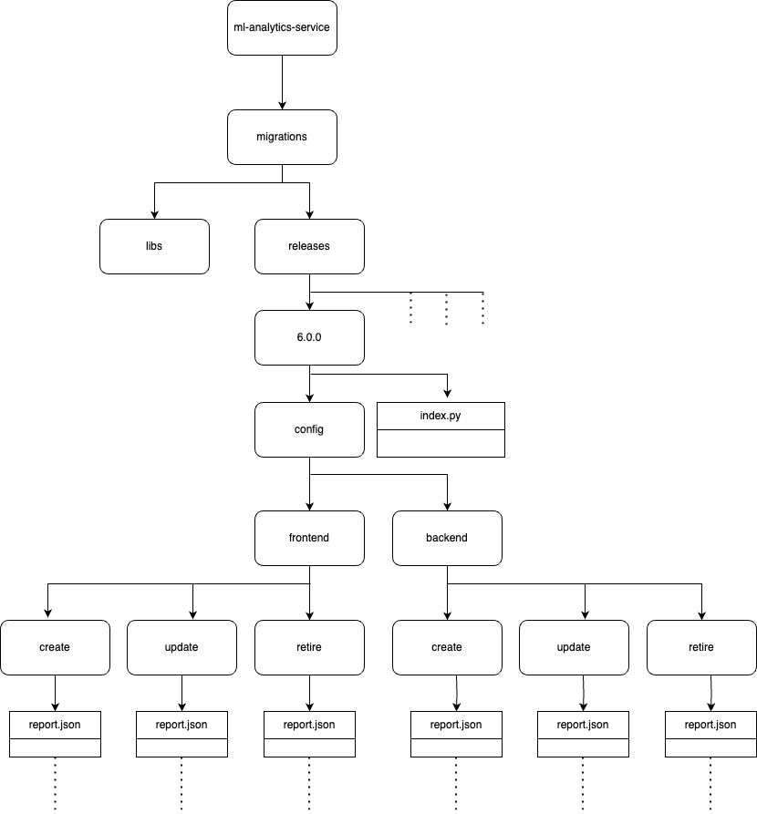

# Report creation and Updation Scripts

Migration scripts are used to create, update or retire Charts and Reports in the respective environments.

The automation scripts will be executed once in all releases to create new reports or charts, update the existing reports or charts or retire existing reports or charts based on the requirements for a release.

During each release, a new folder with the release version is created and the JSON config for the CRUD operation is created in the respective directories.&#x20;

The index.py file will control the execution of the JSON config. The sequence of execution of the operations can be specified in the index file.

The index file will internally access the library created to call the backend APIs to perform CRUD operations.

The status is logged in the Mongo logger collection to avoid the duplication run of the charts/reports in case of any duplicate execution of the script or any re-run due to error.

\

Folder Structure :

<figure><figcaption></figcaption></figure>


