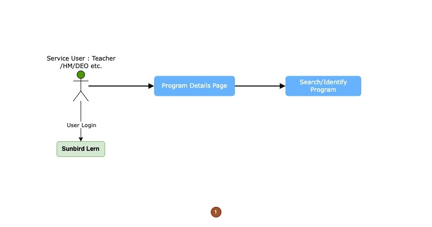

# User Flow Diagram

## User Interaction For Program on Manage Learn

<figure><figcaption>
Program Flow Level 0
</figcaption></figure>

<figure><figcaption>
Program Flow Level 1
</figcaption></figure>

The Program flow diagrams depict user engagement with the [ML Core Service](../ml-core-service.md), highlighting the step-by-step progression and engagements inherent to its usage. These visual aids offer a lucid representation of the user's path and the procedures intrinsic to the core service.

In the program, Different resources are mapped that users can consume.

Beyond direct user engagements, the [ML Core Service](../ml-core-service.md) relies upon various auxiliary services to accomplish its functions and provide an uninterrupted user experience.

These services include:

1. [ML Project Service](../ml-project-service.md)
2. [ML Reports Service](../ml-report-service.md)
3. [Learner Service](https://lern.sunbird.org/learn/readme)

Collectively, these services forge a unified ecosystem, empowering the [ML Core Service](../ml-core-service.md) to provide programs, solutions and other core module functionalities. The harmonious interconnections and interdependencies guarantee a seamless user experience and effective management within the broader SunbirdEd platform.\\
