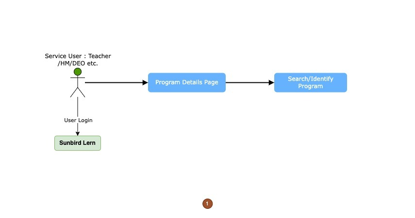
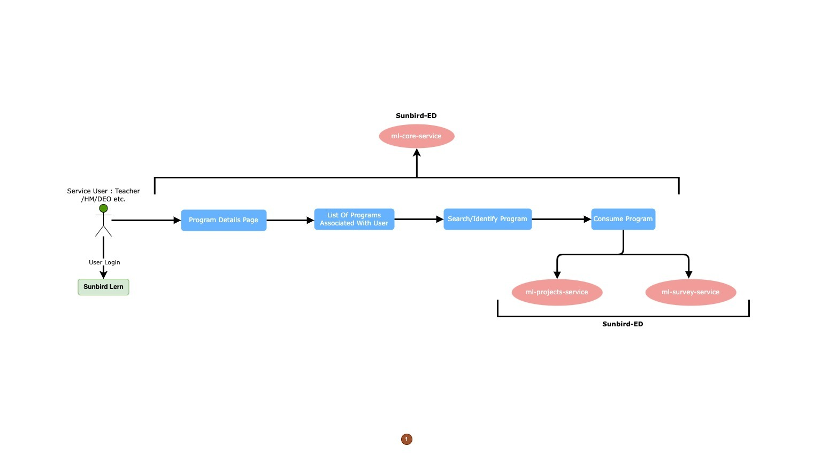

# User Interaction

## User Interaction For Program on Manage Learn&#x20;

<figure><figcaption></figcaption></figure>

<figure><figcaption></figcaption></figure>

The Program flow diagrams depict user engagement with the ML Core Service, highlighting the step-by-step progression and engagements inherent to its usage. These visual aids offer a lucid representation of the user's path and the procedures intrinsic to the core service.

In the program, Different resources are mapped that users can consume.

Beyond direct user engagements, the ML Core Service relies upon various auxiliary services to accomplish its functions and provide an uninterrupted user experience.

These services include:

1. [ML Project Service](../ml-project-service/)
2. [ML Reports Service](../ml-report-service/)
3. Learner Service

Collectively, these services forge a unified ecosystem, empowering the ML Core Service to provide programs, solutions and other core module functionalities. The harmonious interconnections and interdependencies guarantee a seamless user experience and effective management within the broader SunbirdEd platform.\

