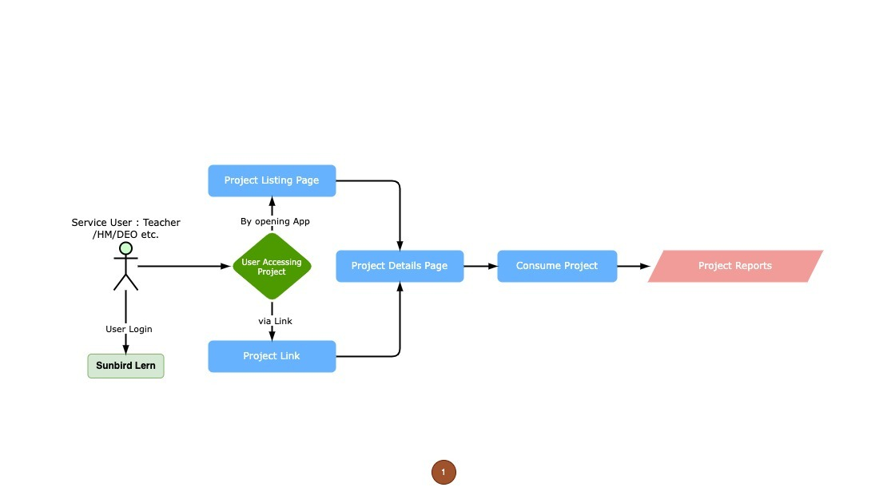
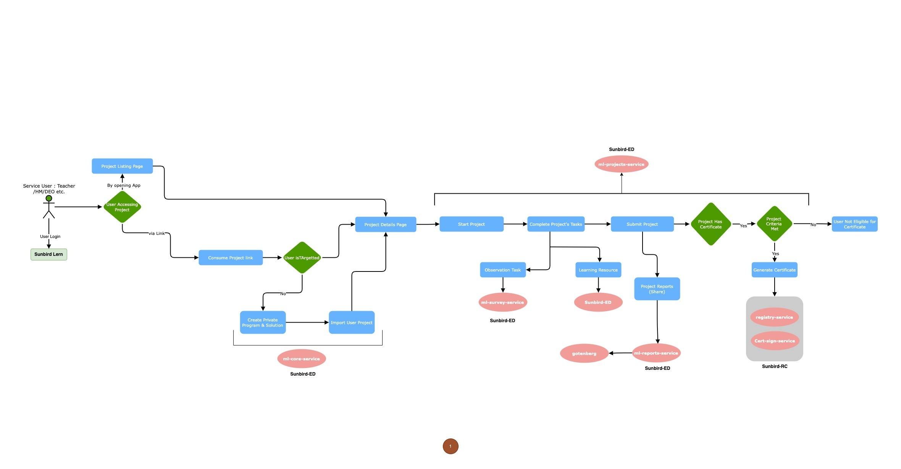

# User Flow Diagram

<figure><figcaption>
Project Flow Level 0
</figcaption></figure>

<figure><figcaption>
Project Flow Level 1
</figcaption></figure>

The Project flow diagrams depict user engagement with the [ML Project Service](../ml-project-service.md), highlighting the step-by-step progression and engagements inherent to its usage. These visual aids offer a lucid representation of the user's path and the procedures intrinsic to the project's service.

Beyond direct user engagements, the [ML Project Service](../ml-project-service.md) relies upon various auxiliary services to accomplish its functions and provide an uninterrupted user experience.

These services include:

1. [ML Core Service](../ml-core-service.md)
2. [ML Project Service](../ml-project-service.md)
3. [ML Reports Service](../ml-report-service.md)
4. [Sunbird RC](https://docs.sunbirdrc.dev/learn/readme)
5. [Gotenberg ](https://gotenberg.dev/)

Collectively, these services forge a unified ecosystem, empowering the [ML Project Service](../ml-project-service.md) to provide extensive project management functionalities and furnish users with insightful reports. The harmonious interconnections and interdependencies guarantee a seamless user experience and effective project management within the broader SunbirdEd platform.\

