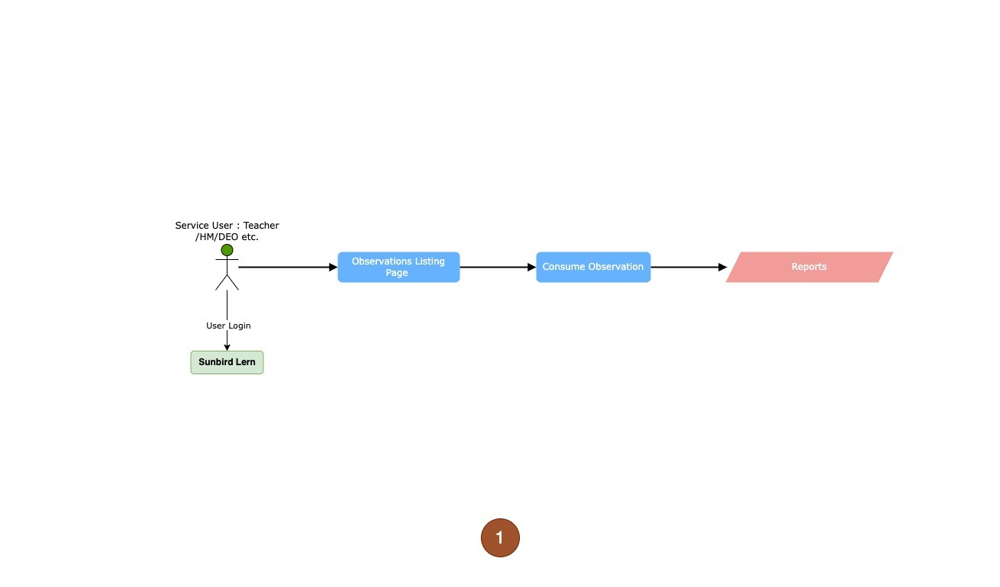
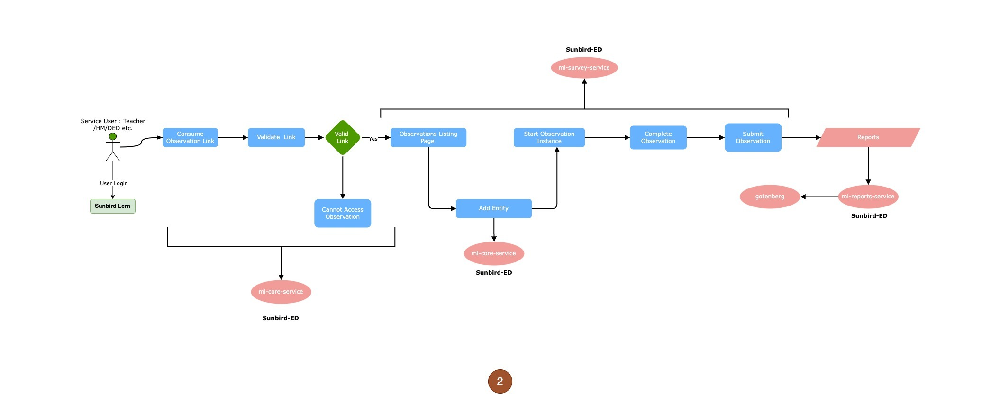
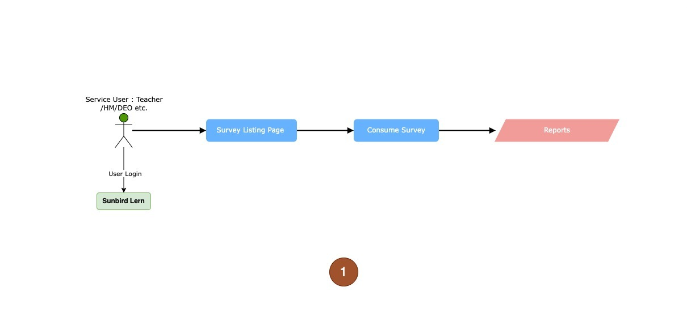
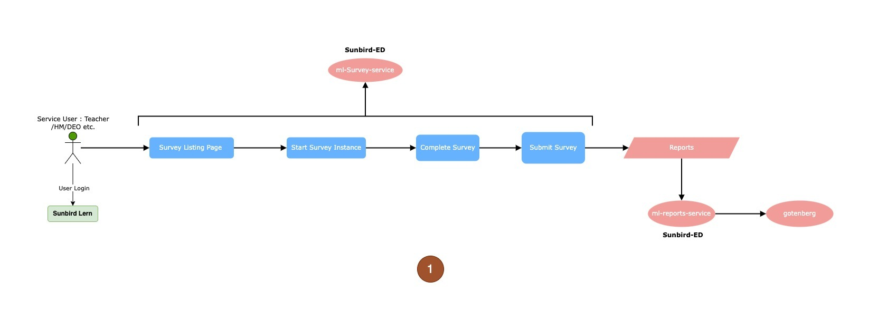
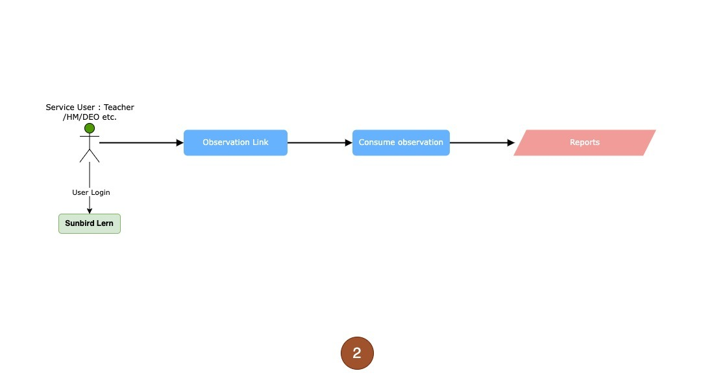
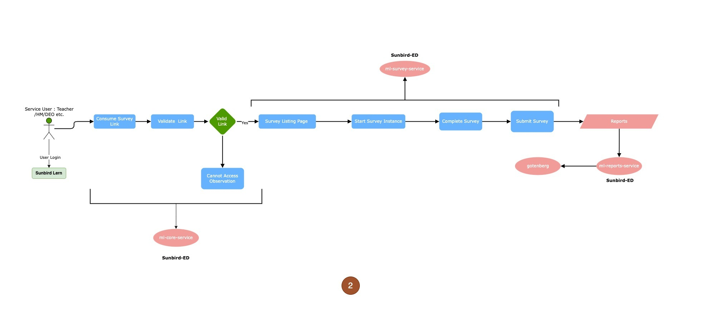
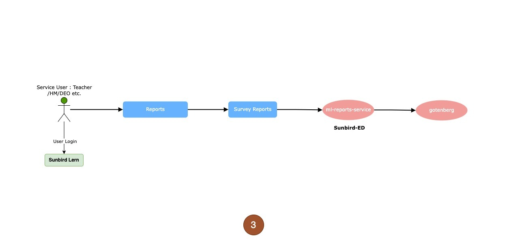

# User Interaction

## Observation Consumption and Report Generation Flow

<figure><figcaption>
Level 0 Observation Flow
</figcaption></figure>

The image above illustrates the process through which users can engage with observations from the Sunbird app and portal. The depicted flow encompasses the journey from the initial discovery of observations to their consumption, ultimately leading to the generation of reports. This overview presents a high-level workflow that outlines the sequence of steps involved in this process.

<figure><figcaption>
Level 1 Observation Flow
</figcaption></figure>

This workflow diagram illustrates each step encompassed within the process of observation consumption. The steps encompass observation discovery, entity addition, start observation, submission of observation, and report generation. Throughout this workflow, distinct building blocks and microservices play integral roles at each stage. Notably, the workflow involves the utilization of various microservices, including the [ML Core Service](../ml-core-service/), [ML Reports Service](../ml-report-service/), and Gotenberg, each contributing to the seamless execution of the process.

<figure><figcaption>
Level 0 Observtaion Flow
</figcaption></figure>

Consumption of observations can also occur through links, aligning with the workflow above.

<figure><figcaption>
Level 1 Observation Flow
</figcaption></figure>

The process of consuming observations via links introduces additional steps, primarily focused on validating the observation's current status, whether it is active or expired. This validation entails a series of supplementary steps, as explained in the preceding workflow.

<figure><figcaption>
Observation Report Flow
</figcaption></figure>

Subsequent to consumption, users have the option to request reports. This entails the engagement of ML Reports and Gotenberg services to generate the desired reports.

## Survey Consumption and Report Generation Flow

<figure><figcaption>
Level 0 Survey Flow
</figcaption></figure>

The image above illustrates the process through which users can engage with survey from the Sunbird app. The represented flow encompasses the journey from the initial discovery of the survey to their consumption, ultimately leading to the generation of reports. This overview presents a high-level workflow that outlines the sequence of steps involved in this process.

<figure><figcaption>
Level 1 Survey Flow 
</figcaption></figure>

This workflow diagram illustrates each step encompassed within the process of survey consumption. The steps encompass survey discovery, starting survey, submission of survey, and report generation. Throughout this workflow, distinct building blocks and microservices play integral roles at each stage. Notably, the workflow involves the utilization of various microservices, including the [ML Reports Service](../ml-core-service/), and Gotenberg, each contributing to the seamless execution of the process.

<figure><figcaption>
Level 0 Survey Flow
</figcaption></figure>

Consumption of survey can also occur through links, aligning with the workflow above

<figure><figcaption>
Level 1 Survey Flow
</figcaption></figure>

The process of consuming survey via links introduces additional steps, primarily focused on validating the survey's current status, whether it is active or expired. This validation entails a series of supplementary steps, as explained in the preceding workflow.

<figure><figcaption>
Survey Reports Flow
</figcaption></figure>

Subsequent to consumption, users have the option to request reports. This entails the engagement of ML Reports and Gotenberg services to generate the desired reports.
