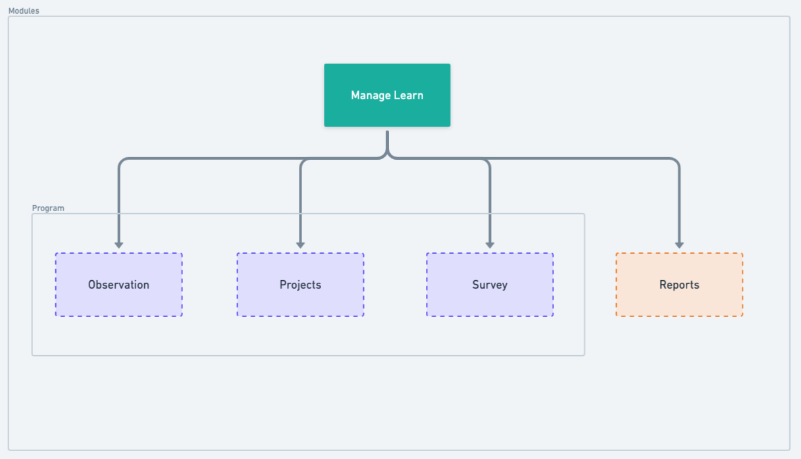
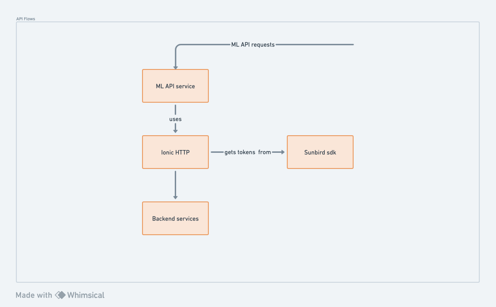

# App - Manage Learn - component diagram

Understand more on Manage Learn [here](https://ed.sunbird.org/misc/templates-1/overview/what-is-manage-learn).

### Core Features

<figure><figcaption></figcaption></figure>

### Core modules

* [Observation](observation-and-survey.md) - Read more on Observation [here](https://ed.sunbird.org/misc/templates-1/overview/what-is-observation).
* [Survey](observation-and-survey.md) - Read more on the Survey [here](https://ed.sunbird.org/misc/templates-1/overview/what-is-a-survey). The survey can be used within or outside a program.
* [Projects](projects.md)&#x20;
* [Program](https://app.gitbook.com/o/-Mi9QwJlsfb7xuxTBc0J/s/-MkgPDmvKwE\_DgYJbvPS/\~/changes/892/development-resources/misc-pages/app-manage-learn-component-diagram/program)
* Reports - The User will be able to see the reports for all the different capabilities for the submissions he/she has done on the platform.

### API Service

<figure><figcaption></figcaption></figure>

All Manage  Learn API request passes through a common API service which internally calls Sunbird-SDK function to get the Authorization. and access tokens

