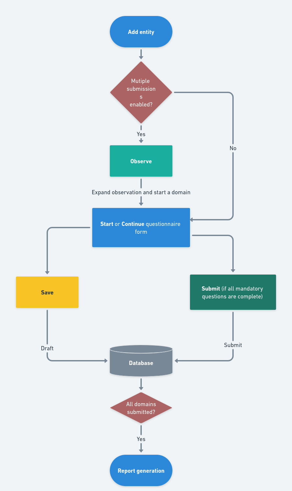
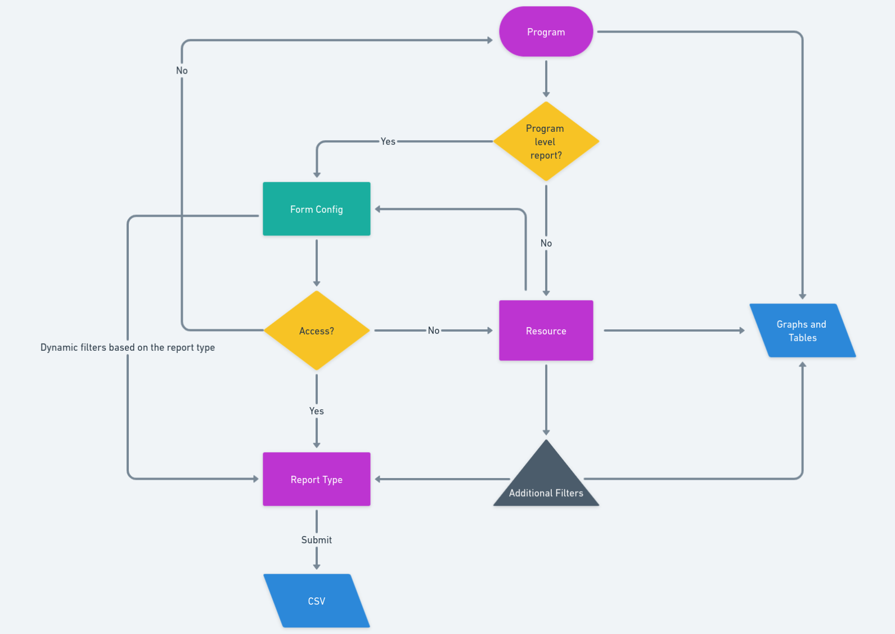

# Portal - Manage Learn - component diagram

<figure><figcaption>
Core modules of Manage Learn
</figcaption></figure>

### [Observation](https://sunbird-ed.github.io/docs/portal/modules/ObservationModule.html)

[What is an observation?](https://ed.sunbird.org/misc/templates-1/overview/what-is-observation)

This module consists of flows like observation listing, Observation details, entity addition, etc. Only the logged-in user will be able to access these features.

_**Observation Listing**_ -Observation can be targeted to specific roles or roles in the system. If the logged-in user role/roles matches with the targeted roles of the observation, the observation will be shown to the user. Targeted observations will be listed in the Observation tile of the portal.

_**Observation details**_ - This page shows the complete information about the observation and also allows the user to add an entity, remove an entity, etc. Users will be only able to add entities as specified in the observation.\

<figure><figcaption>
Observation flow
</figcaption></figure>

[_Postman form config to enable observation on menu menu bar_ ](https://www.postman.com/sunbird-building-blocks/workspace/sunbird-ed/folder/25186239-e1369c8a-bfd2-4980-a0ca-c2ec83fdd7c1)

[_Postman form config to enable observation for teacher role_](https://www.postman.com/sunbird-building-blocks/workspace/sunbird-ed/folder/25186239-b93d5ca8-e547-497e-9aa3-d7b545e02823)

### [Questionnaire](https://sunbird-ed.github.io/docs/portal/modules/QuestionnaireModule.html)

Observation has the ability to render seven different types of question types(radio, multi-select, text, number, date, etc). This module consists of the SL-Questionnaire library which will enable the rendering of all types of questions.  Post completing the  form the user will be able to submit the form to the backend.

&#x20;[_SL-Questionnaire Github Repository_](https://github.com/shikshalokam/sl-questionnaire-components)

<figure><figcaption>
SL-Questionnaire library overview
</figcaption></figure>

### [Program Dashboard](https://sunbird-ed.github.io/docs/portal/modules/programDashboardModule.html)

The Program Manager (PM) and Program Designers (PD) will have access to the Program level reports of the submitted user. This will help them to track the progress and other information of the program and solutions (Improvement, Observation, Survey).

The PM and PD  will be able to view multiple reports and CSV. All  components and libraries for this flow are included in this module.

<figure><figcaption>
Program Dashboard Flow
</figcaption></figure>

_To understand more on reports -_ [_Accessing reports from report service_](https://project-sunbird.atlassian.net/wiki/spaces/\~5c5187317f1b2543d286030f/pages/3166306311/Report+Service+-+Accessing+Reports)

_To understand more on form config -_[ _Form configuration for program dashboard_](https://project-sunbird.atlassian.net/wiki/spaces/MC/pages/3339780108/PD+-+Form+Config+-+Release-6.0.0+User+Detail+Report)

_Postman collection for_ [_Program Dashboard form configuration_](https://www.postman.com/sunbird-building-blocks/workspace/sunbird-ed/folder/25186239-eda3076e-66c4-4271-bdf7-cef3b962b551)

### [Report](https://sunbird-ed.github.io/docs/portal/modules/ReportModule.html)

Logged-in users will be able to view the reports of submissions he/she had made. This module contains all the components and flows for the report viewing. \
\
_For more visit:_ [_ML Observartion Reports_](https://app.gitbook.com/o/-Mi9QwJlsfb7xuxTBc0J/s/-MkgPDmvKwE\_DgYJbvPS/\~/changes/891/development-resources/misc-pages/portal-manage-learn-reports)

_Presentation on_[ _ML Capabilities on portal_](https://docs.google.com/presentation/d/1bsC86EGydtdPRha79SEQrhDo9zR7uxCTzIt58OC\_zUE/edit#slide=id.g13ee83f8e0d\_0\_41)\
\
[_Manage Learn API Collection_](https://documenter.getpostman.com/view/7997930/2s946chuaT#603e751e-e64d-4e06-9c1a-4963f42a2b6b)

