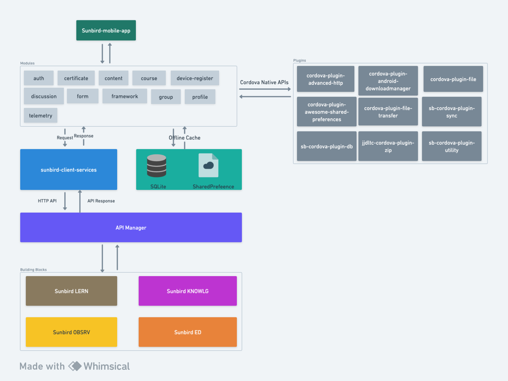

# sunbird-mobile-sdk

### GitHub Repo

[sunbird-mobile-sdk](https://github.com/Sunbird-Ed/sunbird-mobile-sdk/tree/master)

### Architecture

<figure><figcaption></figcaption></figure>

### Source Code

The sunbird-mobile-sdk follows a basic typescript library code structure which is modular in nature. The following diagram shows the folder structure of the SDK.

<figure><figcaption></figcaption></figure>

#### plugins

#### src
