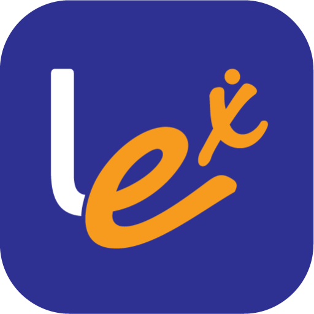

# Adopters

Sunbird ED has been leveraged to develop the following solutions:&#x20;

<table><thead><tr><th width="214.94138736231332"></th><th></th></tr></thead><tbody><tr><td></td><td><a href="https://diksha.gov.in/">DIKSHA</a> by NCERT: Digital Infrastructure for Knowledge Sharing (DIKSHA) is the national school education platform of India and has been adopted by all 36 states and UTs across India thus impacting nearly every student and teacher in the country. It is one of the largest education platforms in the world.  </td></tr><tr><td></td><td>Lex by Infosys: Lex is a platform, that can be used by organisations, to deliver professional development to its workforce. It is a cloud-first and mobile-first solution that is designed to be accessible anytime, anywhere and on any device.</td></tr></tbody></table>

&#x20;

