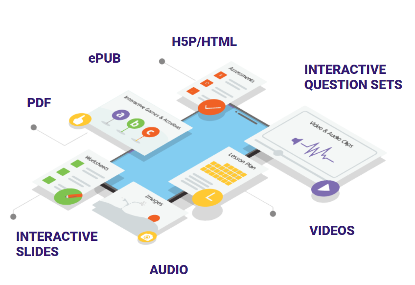

# Rich and diverse content

Sunbird ED allows you to consume a variety of content enabling rich learning experiences.

Users can access content in multiple formats using content players.

Following are the various types of contents that can be consumed on sunbird ED learning apps-

1. **PDF** - PDF stands for "portable document format". Essentially, the format is used when you need to save files that cannot be modified but still need to be easily shared and printed. PDF documents can contain links and buttons, form fields, audio, video and business logic. Sunbird ED's learning apps use PDF format for users to consume reading material, comics, class books, etc.
2. **Epub** - EPUB is an e-book file format that uses the ".epub" file extension. The term is short for electronic publication and is sometimes styled ePub. Similar to that for PDF, Sunbird ED's learning apps use Epub format for users to consume reading material, comics, class books, etc.
3. **Video** - A video format is a container that stores audio, video, subtitles, and any other metadata. Sunbird ED's learning apps use video format for users to consume explanation videos, TV classes, etc.
4. **Audio** - An audio file format is a file format for storing digital audio, subtitles, and any other metadata. Sunbird ED's learning apps use audio format for users to consume TV classes, podcasts, etc.
5. **HTML** - HTML stands for HyperText Markup Language. It’s the way web pages are coded so that text is formatted and images/videos are added. Sunbird ED's learning apps use HTML format for users to consume interactive content, 3D content, etc.
6. **H5P** - H5P is an abbreviation for **HTML5 Package**. It enables educators to create content for educational purposes. Sunbird ED's learning apps use H5P format for users to consume interactive videos, presentations, etc.
7. **ECML** - ECML stands for Ekstep content markup language. It is used to give creators more flexibility and configurability while creating interactive content. Sunbird ED's learning apps use ECML format for users to consume interactive content, questions, quizzes, etc.

The above capabilities of Rich and Diverse Content are derived from components of Sunbird Knowlg. You can find details by clicking on the link [here](product-and-developers-guide/rich-and-diverse-content.md)
