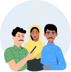

# Actors & Actions

<table><thead><tr><th>Actors</th><th>Actions</th><th data-hidden>Avatar</th></tr></thead><tbody><tr><td>

Learner (students, farmers, healthcare professionals, youth, and adults)
</td><td><ol><li>Discover <em>content for your learning</em></li><li>Consume <em>content for your learning</em></li><li><em>Evaluate your learning by Enrolling to collections (courses and many more)</em></li><li>Earn learning <em>credentials such as certificates</em></li><li>Monitor your learning <em>progress</em></li></ol></td><td></td></tr><tr><td>

Guardian/Parent (any caregiver)
</td><td>

<ol><li>Discover c<em>ontent for your learning</em></li><li>Consume <em>content for your learning</em></li><li>Monitor your child's learning <em>progress</em></li></ol></td><td></td></tr><tr><td>

Teacher/Mentor/Guru (anyone providing formal/Informal teaching)
</td><td>

<ol><li>Discover <em>content for your learning</em></li><li>Consume <em>content for your learning</em></li><li><em>Evaluate your learning by Enrolling to collections (courses and many more)</em></li><li>Earn learning <em>credentials such as certificates</em></li><li>Monitor your learning <em>progress</em></li></ol></td><td></td></tr><tr><td>

Administrator (anyone who can help manage the learning and capacity building processes)
</td><td>

<ol><li>Discover <em>content for your learning</em></li><li>Consume <em>content for your learning</em></li><li><em>Evaluate your learning by Enrolling to collections (courses and many more)</em></li><li>Earn learning <em>credentials such as certificates</em></li><li><em>Conduct Surveys, Observations among stakeholders like schools.</em></li><li><em>Support Roles like District, Block, Cluster Level  Administration to create their workflows.</em></li></ol></td><td></td></tr><tr><td>

Community Member (anyone from society, Including market players)
</td><td><ol><li>Discover content for your learning. </li><li>Consume content for learning. </li><li>Evaluate your learning by enrolling into collections (Courses and many more). </li><li>Earn learning credentials such as certificates.</li><li> Monitor your learning progress.</li></ol></td><td></td></tr></tbody></table>

**Note** - Definition of Asset, collections can be found out in Learn ->Terminology section ahead
