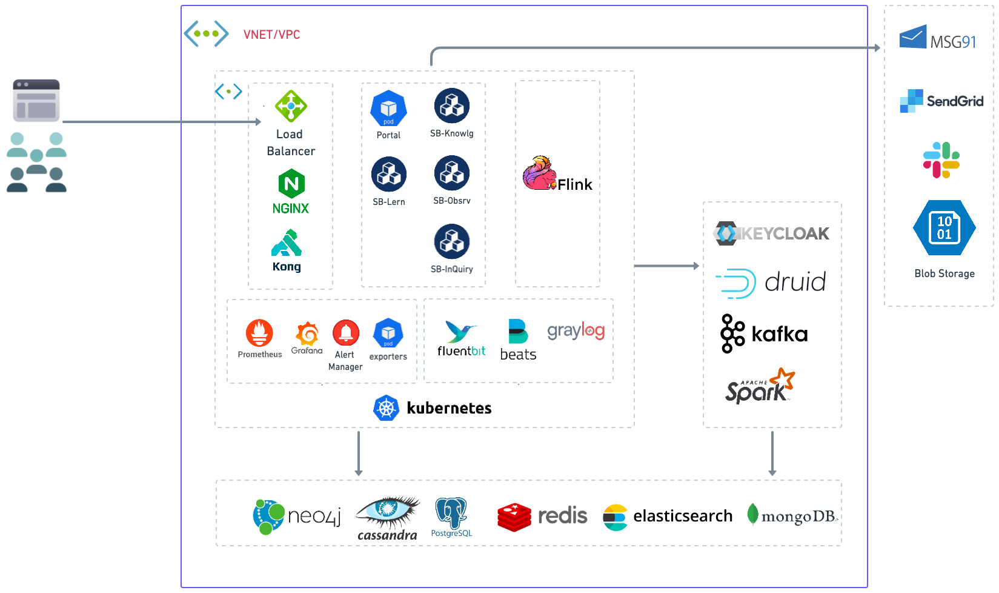

# Deployment Overview

Sunbird ED is a cloud-agnostic platform that can be deployed on various cloud platforms, including Azure, Amazon Web Services (AWS),  Google Cloud Platform (GCP) and OCI. The most common deployment architecture is a cloud-based platform, which offers several advantages, such as scalability, reliability, and maintainability.&#x20;

The following diagram depicts the high-level deployment architecture of the SunbirdEd platform. &#x20;

<figure><figcaption></figcaption></figure>

The ideal network configuration depends on the quantity of environments you wish to establish. It is advisable to create a corresponding number of virtual cloud networks, each paired with an administrative virtual network. Within each virtual network, there should be a robust bastion host dedicated to SSH access and a CI slave responsible for code deployment. The administrative virtual network, on the other hand, serves as the central hub for essential utility services, including the CI master server and VPN server, etc.&#x20;

<figure><figcaption></figcaption></figure>

Within each virtual network in every environment, several distinct subnets are assigned specific roles for hosting various workloads. These roles typically include administrative tasks, containerised and non-containerised applications, and data workloads. To ensure the secure flow of data, the ingress and egress of data between subnets and servers are meticulously controlled by implementing network security groups.

<figure><figcaption></figcaption></figure>

**Note**: Azure cloud-specific resource icons are used in the above diagrams for representation purposes only. However, other cloud service providers can use the equivalent resource/service based on your choice.
