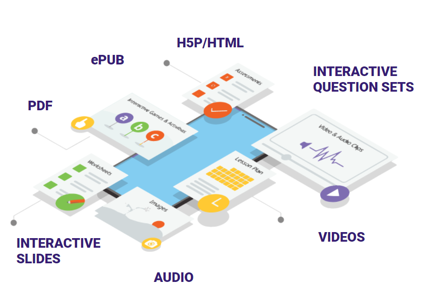

# Workflows

Any Actor in the system will go through the workflow in following steps:

.PNG>)

**OnBoard / Setup User** : Sunbird reference apps allow users to onboard either anonymously or as via logins. This step ensures that users really discover assets that are relevant to them. This step allows users to pull personalised recommendation from the system.

**Discover Asset** : With a diverse pool of assets or content available, and a diverse set of personas reaching the platform - each with their goals and needs, there need to be multiple options for learners to discover the most relevant content.

**Consume Asset** : Sunbird supports various number of content format such as videos, mp3, slides, interactive content (like H5P/HTML), PDFs, ePubs and ECML, Sunbird ED allows users to consume assets in both online and offline mode with its state of art players

**Earn Credentials**: Then comes the building block of earning credentials - every time a user consumes content that earns her a certificate or a badge, these get recorded in the users passbook

**Interact / Collaborate**: Using sunbird Lern, adopter can integrate Groups, Discussion forum and notifications to enable interaction and collaboration on reference apps
