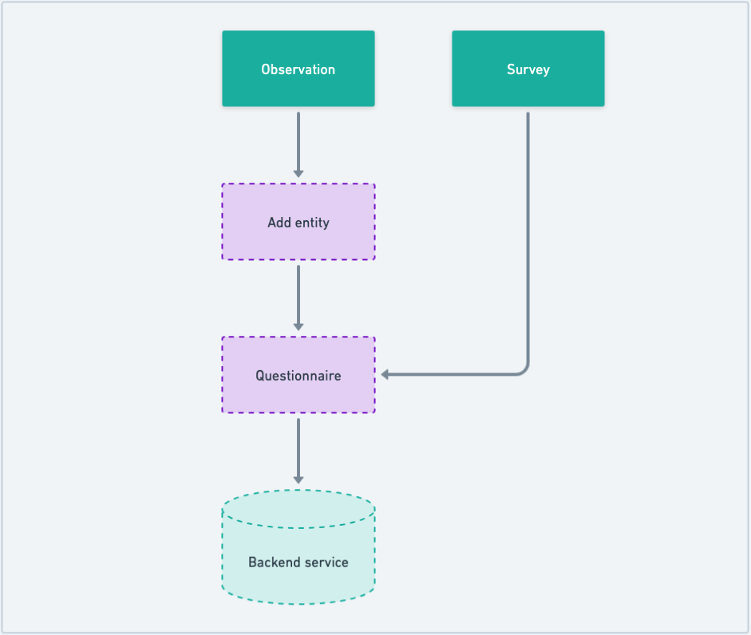

# Observation & Survey

<figure><figcaption></figcaption></figure>

### [Observation](https://sunbird-ed.github.io/docs/mobile/modules/ObservationModule.html)

[Observations](https://ed.sunbird.org/misc/templates-1/overview/what-is-observation) are a set of questionnaires that are specific to a particular entity (such as a school block or cluster). Observations can be recorded at multiple instances, whenever necessary.

### [Add Entity](https://sunbird-ed.github.io/docs/mobile/components/EntitySearchLocalComponent.html)

The user will only be able to add [entities](https://ed.sunbird.org/misc/templates-1/overview/what-is-an-entity) to which he has access and also the entity type to which the observation is targeted. Add entity flow is only available for the observation flow.

### [Survey](https://sunbird-ed.github.io/docs/mobile/modules/SurveyModule.html)

The main difference between a [survey](https://ed.sunbird.org/misc/templates-1/overview/what-is-a-survey) and observation is that survey does not have an entity tagged to it.

### [Questionnaire](https://sunbird-ed.github.io/docs/mobile/modules/QuestionnairePageModule.html)

The questionnaire is used for rendering different types of questions. Seven different types of questions are supported by the questionnaire. Once the observation or survey is started, all the questions are saved locally, and only upon submission, the data will be submitted to the backend. Both survey and observation use the same questionnaire component to render the questions.
