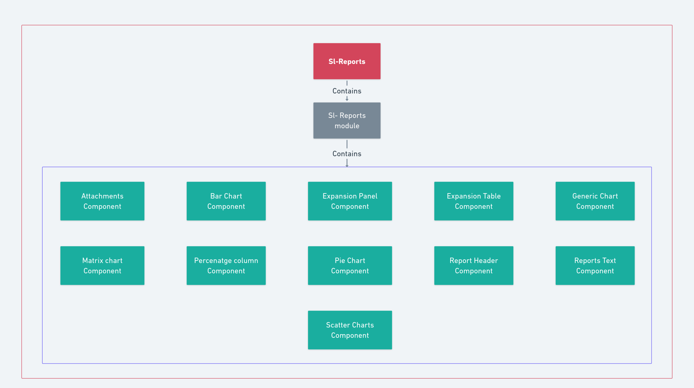

# Portal - Manage Learn - Reports

In portal The list of observation reports submitted by users can be accessed through the solution-listing page on the portal using user-specific details like entity information (such as school, block, district, etc.) and roles (e.g., HM, DEO). For a more comprehensive view, the detailed reports can be accessed on the report-view page. This page allows for advanced filtering of reports and provides the option to export them as PDFs. The filtering can be done using tabs namely the question tab and criteria tab. The reports can also be filtered at each submission level.

[_SL-Reports NPM package_](https://www.npmjs.com/package/@shikshalokam/sl-reports-library)

SL-Reports library is useful for rendering various types of charts leveraging plugins such as c\_hartjs\_ for visualisation of data, _chartjs-plugin-datalabels_ for enhancing the readability and understanding of the charts, ng2Charts to effectively integrate chartjs with angular and chartjs-plugin-stacked100 to showcase the proportions of the datasets effectively.

<figure><figcaption>
SL-Reports Overview
</figcaption></figure>

Within this library, each chart type corresponds to its own dedicated component e.g `BarChartComponent` for bar charts, `PieChartComponent` for pie charts etc. This design allows for a streamlined approach, enabling developers to seamlessly integrate the necessary chart components directly into their project templates. By supplying appropriate configurations tailored to each component's specifications, users can efficiently harness the power of these charts to enhance data visualisation.

<figure><figcaption>
SL-Reports Detailed View
</figcaption></figure>
