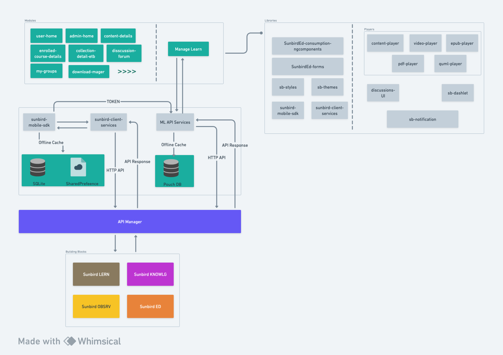

# Component Diagram



## Architecture

<figure><figcaption></figcaption></figure>

## [Source Code](https://github.com/Sunbird-Ed/SunbirdEd-mobile-app/tree/master)

Sunbird Mobiles app follows a basic angular / Ionic code structure. The top level of the workspace contains workspace-wide configuration files, configuration files for the application, and test files.

<figure><figcaption></figcaption></figure>

\
All following primary folders are highlighted in the above screenshot

* plugins
* [app](https://github.com/Sunbird-Ed/SunbirdEd-mobile-app/tree/master/src/app)
* [directives](https://github.com/Sunbird-Ed/SunbirdEd-mobile-app/tree/master/src/directives)
* [pipes](https://github.com/Sunbird-Ed/SunbirdEd-mobile-app/tree/master/src/pipes)
* [services](https://github.com/Sunbird-Ed/SunbirdEd-mobile-app/tree/master/src/services)

### **plugins**

**plugins** folder contains all the plugins which provide JavaScript interface to native components (Android/ Ios)required by Sunbird Mobile App. They allow the app to use native device capabilities beyond what is available to pure web components.

[List of plugins used in the Sunbird Mobile app](../../../../development-resources/misc-pages/sunbird-mobile-app-plugins.md)

### app

This folder contains all the modules and components. It contains the Sunbird Mobile app's logic and data.&#x20;

#### Modules

As Modules are a great way to organize an application and extend it with capabilities from external libraries so, in the Sunbird-mobile-app, each functionality/page is configured as a Module. Some key modules are given in the below diagram.

<figure><figcaption></figcaption></figure>

* [home](https://sunbird-ed.github.io/docs/mobile/modules/HomePageModule.html)
* [qrcoderesult](https://sunbird-ed.github.io/docs/mobile/modules/QrcoderesultPageModule.html)
* [content-details](https://sunbird-ed.github.io/docs/mobile/modules/ContentDetailsPageModule.html)
* [enrolled-course-details](https://sunbird-ed.github.io/docs/mobile/modules/EnrolledCourseDetailsPagePageModule.html)
* [collection-detail-etb](https://sunbird-ed.github.io/docs/mobile/modules/CollectionDetailEtbPageModule.html)
* [discussion-forum](https://sunbird-ed.github.io/docs/mobile/modules/DiscussionForumModule.html)
* [my-groups](https://sunbird-ed.github.io/docs/mobile/modules/MyGroupsPageModule.html)
* [download-manager](https://sunbird-ed.github.io/docs/mobile/modules/DownloadManagerPageModule.html)

&#x20;    **. . . . . . . . . . . .**

### directives

This folder contains classes that can add new behavior to the elements in the template or modify existing behavior. These classes are used to maneuver the DOM by adding/ removing new elements to DOM and even changing the appearance of the DOM elements.

Following are a few key directives in the app

* [custom-ion-select](https://sunbird-ed.github.io/docs/mobile/directives/CustomIonSelectDirective.html)
* [read-more](https://sunbird-ed.github.io/docs/mobile/directives/HideHeaderFooterDirective.html)
* [hide-header-foote**r**](https://sunbird-ed.github.io/docs/mobile/directives/ReadMoreDirective.html)

**. . . . . . . . . . .**

### pipes

This folder contains classes containing simple functions to use in template expressions to accept an input value and return a transformed value.

* [category-key-translator](https://sunbird-ed.github.io/docs/mobile/pipes/CategoryKeyTranslator.html)
* [date-ago](https://sunbird-ed.github.io/docs/mobile/pipes/DateAgoPipe.html)
* [file-size](https://sunbird-ed.github.io/docs/mobile/pipes/FileSizePipe.html)
* [mime-type](https://sunbird-ed.github.io/docs/mobile/pipes/MimeTypePipe.html)
* [translate-html](https://sunbird-ed.github.io/docs/mobile/pipes/TranslateHtmlPipe.html)
* [translate-jso**n**](https://sunbird-ed.github.io/docs/mobile/pipes/TranslateJsonPipe.html)

**. . . . . . . .  . .**&#x20;

### services

This folder contains classes with the @injectible decorator. This decorator tells angular that the class is a service and can be injected into components that need that service.

* [android-permissions](https://sunbird-ed.github.io/docs/mobile/injectables/AndroidPermissionsService.html)
* [common-form-config-builders](https://sunbird-ed.github.io/docs/mobile/injectables/FrameworkCommonFormConfigBuilder.html)
* [discussion](https://sunbird-ed.github.io/docs/mobile/injectables/DiscussionTelemetryService.html)
* [download-pdf](https://sunbird-ed.github.io/docs/mobile/injectables/DownloadPdfService.html)
* [form-location-factory](https://sunbird-ed.github.io/docs/mobile/injectables/FormAndFrameworkUtilService.html)
* [print-pdf](https://sunbird-ed.github.io/docs/mobile/injectables/PrintPdfService.html)
* [user-groups](https://sunbird-ed.github.io/docs/mobile/injectables/ProfileHandler.html)

**. . . . . . . . . . .**&#x20;

### **sunbird-mobile-sdk**

sunbird-mobile-sdk is the heart of Sunbird-mobile-app which contains all the business logic starting from API access to offline data management.

<figure><figcaption></figcaption></figure>

### Configurations required to  setup Sunbird-mobile-app

These are the set of files required  to set up Sunbird-mobile-app

* [sunbird.properties](configurations-to-setup-mobile-app.md#1.-sunbird.properties)
* [google-service.json](configurations-to-setup-mobile-app.md#2.-google-service.json)

### Forms required to  initialize Sunbird-mobile-app

The Form Configurations are a set of predefined forms that enable users to easily modify the UI without changing anything in the source code. Also, it allows users to quickly update any type of app attribute even if the app is already available in Play Store/app store without any app update.

[List of forms available in Sunbird-Mobile-app](../../../../development-resources/misc-pages/mobile-form-configurations.md)

