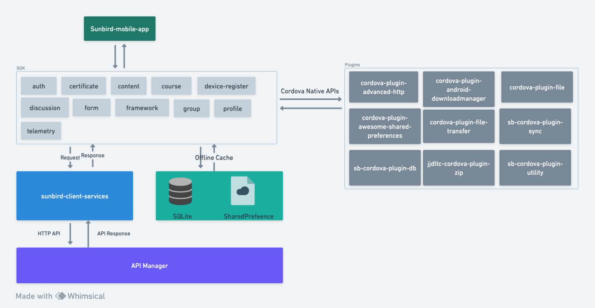

# sunbird-mobile-sdk



### Architecture

<figure><figcaption></figcaption></figure>

### Source Code

The sunbird-mobile-sdk follows a basic typescript library code structure that is modular. The following diagram shows the folder structure of the SDK.

<figure><figcaption></figcaption></figure>

plugins

This folder contains the definition file of all the plugins used in the sunbird-mobile-sdk.

<figure><figcaption></figcaption></figure>

Each definition file contains the plugin methods and the models. one sample definition file is as follows

````typescript
```
interface HttpResponse {
    status: number;
    headers: any;
    url: string;
    data?: any;
    error?: string;
}

interface Cordova {
    plugin: {
        http: {
            setDataSerializer: (string) => void;
            setHeader: (host: string, header: string, value: string) => void;
            get: (url: string, parameters: any, headers: { [key: string]: string },
                  successCallback: (response: HttpResponse) => void,
                  errorCallback: (response: HttpResponse) => void) => void;
            patch: (url: string, data: any, headers: { [key: string]: string },
                    successCallback: (response: HttpResponse) => void,
                    errorCallback: (response: HttpResponse) => void) => void;
            post: (url: string, data: any, headers: { [key: string]: string },
                   successCallback: (response: HttpResponse) => void,
                   errorCallback: (response: HttpResponse) => void) => void;
        }
    };
}

```
````

#### src

This folder contains all the modules of sunbird-mobile-sdk. Each module folder contains majorly 5 sub-folders(config, def, errors, handlers, impl) and one index file.

<figure><figcaption></figcaption></figure>

* **config -** This folder contains an interface that contains information about the server endpoints used by this module. One sample interface is as follows

````typescript
```
export interface CourseServiceConfig {
    apiPath: string;
}
```
````

* **def -** This folder contains an interface that contains the methods exposed by this module along with all the model classes used by the module. One sample interface is as follows

````typescript
```
export interface CourseService {
    
    getBatchDetails(request: CourseBatchDetailsRequest): Observable<Batch>;

    updateContentState(request: UpdateContentStateRequest): Observable<boolean>;

    getCourseBatches(request: CourseBatchesRequest): Observable<Batch[]>;

    getUserEnrolledCourses(request: GetUserEnrolledCoursesRequest): Observable<Course[]>;

    enrollCourse(request: EnrollCourseRequest): Observable<boolean>;

    unenrollCourse(unenrollCourseRequest: UnenrollCourseRequest): Observable<boolean>;

    .......................
}
```
````

* **errors -** This folder contains all the error model classes used by the module.
* **handlers -** This folder contains utility classes used across the module.
* **impl -** This folder contains the class that implements the definition interface and it is the actual implementation of the methods exposed by this module. One sample class is as follows


````typescript
```
@injectable()
export class CourseServiceImpl implements CourseService {


    constructor(
        @inject(InjectionTokens.SDK_CONFIG) private sdkConfig: SdkConfig,
        @inject(InjectionTokens.API_SERVICE) private apiService: ApiService,
       ......
    ) {
       
    }


    getBatchDetails(request: CourseBatchDetailsRequest): Observable<Batch> {
        return new GetBatchDetailsHandler(this.apiService, this.courseServiceConfig)
            .handle(request);
    }


    getCourseBatches(request: CourseBatchesRequest): Observable<Batch[]> {
        return new GetCourseBatchesHandler(this.apiService, this.courseServiceConfig).handle(request);
    }


    getUserEnrolledCourses({request, from}: GetUserEnrolledCoursesRequest): Observable<Course[]> {
        return this.cachedItemStore[from === CachedItemRequestSourceFrom.SERVER ? 'get' : 'getCached'](
            request.userId + (request.filters ? '_' + JSON.stringify(request.filters) : ''),
            CourseServiceImpl.USER_ENROLLMENT_LIST_KEY_PREFIX,
            'ttl_' + CourseServiceImpl.USER_ENROLLMENT_LIST_KEY_PREFIX,
            () => this.csCourseService.getUserEnrolledCourses(request, {}, {apiPath: '/api/course/v2', certRegistrationApiPath: ''}),
        );
    }

    enrollCourse(request: EnrollCourseRequest): Observable<boolean> {
        return new EnrollCourseHandler(this.apiService, this.courseServiceConfig)
            .handle(request)
            .pipe(
                mergeMap((isEnrolled) => {
                    if (isEnrolled) {
                        const courseContext: { [key: string]: any } = {};
                        courseContext['userId'] = request.userId;
                        courseContext['batchStatus'] = request.batchStatus;

                        return this.sharedPreferences.putString(ContentKeys.COURSE_CONTEXT, JSON.stringify(courseContext)).pipe(
                            delay(2000),
                            concatMap(() => {
                                return this.getEnrolledCourses({userId: request.userId, returnFreshCourses: true});
                            }),
                            mapTo(isEnrolled)
                        );
                    }

                    return of(isEnrolled);
                })
            );
    }

    ......

```
````

**index.ts -** This file is the registry of all the classes used by this module.


