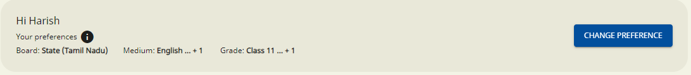

# Portal - Component Diagrams

## GitHub Repository:&#x20;


git


## Architecture

<figure><figcaption>
Sunbird ED Portal Architecture
</figcaption></figure>

## Sunbird ED Portal&#x20;

The Sunbird ED portal is divided into two folders&#x20;

**App** : Contains the Backend code base which used Node.js framework for server-side.

**Client** : Contains the Forntend code base which used Angular framework for client-side

.png>).png>)

## **Sunbird Portal UI**

.png>).png>)

[**Client Folder**](https://github.com/Sunbird-Ed/SunbirdEd-portal/tree/6.0.0/src/app/client) includes the client source code for the Angular application. This folder includes various components, modules, services, styles, and other assets necessary to build the front end of the application.&#x20;

<figure><figcaption>
SUnbird Portal UI Architecture
</figcaption></figure>

**The key module which is used in Sunbird Portal UI**

### [Public ](https://sunbird-ed.github.io/docs/portal/modules/PublicModule.html)

The main objective of this folder is to provide all the public route (i.e. consumers) in one place which can further be leveraged.

This folder contains routing for the modules which can be accessed by everyone and does not have any auth required Ex: guest user/anonymous user.

### [Core](https://sunbird-ed.github.io/docs/portal/modules/CoreModule.html)

The main objective of this folder is to provide a static screen component which is present in every route in one place. which can further be leveraged if needed.

The folder contains those components which are statically positioned though data will be dynamic, we integrate the core components at the app level so that they are present in every route and also provides the routes to different modules such as the header, footer, search, main menu, and language dropdown.

### [Shared](https://sunbird-ed.github.io/docs/portal/modules/SharedModule.html)

The main objective of this folder is to provide all reusable features in one place which can further be leveraged if needed.

The Folder contains all the reusable components across the portal such as the loader, popup, card,sb-data table, alert popup, slick etc...

### Manage Learn

TBU

### Additional Info:

#### Forms

In the portal, lots of UI capabilities are generalised in terms of [formConfig](https://documenter.getpostman.com/view/25186239/2s946pXoZ2). to reduce the code dependency by decoupling form logic from the portal code.

## Front-End Libraries

<figure><figcaption>
Frontend libraries
</figcaption></figure>

The Purpose of all the libraries is to make the UI more consistent across all the clients who are using this library.

|  Library Name      | GitHub Repo                                                                                                                                        | Description                                                                                                                                                                                                       |
| ------------------ | -------------------------------------------------------------------------------------------------------------------------------------------------- | ----------------------------------------------------------------------------------------------------------------------------------------------------------------------------------------------------------------- |
| Common-Consumption | [https://github.com/Sunbird-Ed/SunbirdEd-consumption-ngcomponents#readme](https://github.com/Sunbird-Ed/SunbirdEd-consumption-ngcomponents#readme) | These components are designed to be used in Sunbird consumption platforms _( web portal, offline desktop app)_ to drive reusability, maintainability hence reduce the redundant development effort significantly. |
| SB-Forms           | [https://github.com/Sunbird-Ed/SunbirdEd-forms](https://github.com/Sunbird-Ed/SunbirdEd-forms)                                                     | This Library expects a configuration and renders form according to the view.                                                                                                                                      |
| SB-Dashlet         | [https://github.com/Sunbird-Ed/sb-dashlets](https://github.com/Sunbird-Ed/sb-dashlets)                                                             | Library used for Reusable charts. Supported by charts has an extensible, general purpose analytical presentation capabilities like graphs, tables, charts etc..                                                   |
| Client-Services    | [https://github.com/Sunbird-Ed/sunbird-client-services](https://github.com/Sunbird-Ed/sunbird-client-services)                                     | Library used to create API calls with Sunbird Environment. Includes necessary typescript code to do search, content read, corresponding data models of the platform are available.                                |
| Quml Player        | [https://github.com/Sunbird-inQuiry/player/tree/release-6.0.0](https://github.com/Sunbird-inQuiry/player/tree/release-6.0.0)                       | The library which  is responsible for rendering questions and question sets created according to the QuML specification.                                                                                          |
| Collection-Editors | [https://github.com/Sunbird-Knowlg/sunbird-collection-editor](https://github.com/Sunbird-Knowlg/sunbird-collection-editor)                         | Library which supports to create all type of collections like Book, Course, PlayList & QuestionSet                                                                                                                |
|                    |                                                                                                                                                    |                                                                                                                                                                                                                   |
| Video Player       | [https://github.com/Sunbird-Knowlg/sunbird-video-player](https://github.com/Sunbird-Knowlg/sunbird-video-player)                                   | The Video player library is used to play video/audio content in Sunbird ED                                                                                                                                        |
| PDF Player         | [https://github.com/Sunbird-Knowlg/sunbird-pdf-player](https://github.com/Sunbird-Knowlg/sunbird-pdf-player)                                       | The PDF player library is used to play pdf content on Sunbird ED                                                                                                                                                  |
| Epub Player        | [https://github.com/Sunbird-Knowlg/sunbird-epub-player](https://github.com/Sunbird-Knowlg/sunbird-epub-player)                                     | The Epub player library is used to play epub content on Sunbird ED                                                                                                                                                |

## Sunbird Portal API Servcies&#x20;

.png>)

[**App Folder**](https://github.com/Sunbird-Ed/SunbirdEd-portal/tree/6.0.0/src/app)(without client) Includes backend API interface which is used  Node.js framework.&#x20;

It leverages a keyCloakHelper file to handle login and logout functionalities while adopting token-based session storage to manage user sessions effectively.&#x20;

Additionally, the interface integrates multiple API middleware functions to accomplish tasks such as token verification, API whitelisting, and customizing request headers as needed.

<figure><figcaption>
API Layer Architecture
</figcaption></figure>

### Code Structure

### [User Session Management - **Server.js** ](https://github.com/Sunbird-Ed/SunbirdEd-portal/blob/6.0.0/src/app/server.js)

It is used in web development for the server-side entry point of a Node.js application.

It acts as the main starting point of the server, responsible for initializing the server, defining routes, and handling incoming requests from clients.

it is used to store the session based on [Anonymous](https://project-sunbird.atlassian.net/wiki/spaces/SP/pages/3324477457/Portal+-+Login+Work+flow+post+success+with+keycloak+-+Anonymous) &[ Logged in User](https://project-sunbird.atlassian.net/wiki/spaces/SP/pages/3324182538/Portal+-+Login+Work+flow+post+success+with+keycloak+-+Logged+In+User)

### [**Routes**](https://github.com/Sunbird-Ed/SunbirdEd-portal/tree/6.0.0/src/app/routes)

It handles all the API routes. which are triggering from the client side. such as content/\*, content/copy/questionset etc.

### [API Whitelisting: **Helpers Folder** ](https://github.com/Sunbird-Ed/SunbirdEd-portal/tree/6.0.0/src/app/helpers)

Contains all the js files which are used for user [authentication](https://github.com/Sunbird-Ed/SunbirdEd-portal/blob/release-6.0.0/src/app/helpers/kongTokenHelper.js) and [authorization](https://github.com/Sunbird-Ed/SunbirdEd-portal/blob/release-6.0.0/src/app/helpers/keyCloakHelper.js).

Contains the [API Whitelist](https://github.com/Sunbird-Ed/SunbirdEd-portal/blob/release-6.0.0/src/app/helpers/apiWhiteList.js) js file which Handles whitelisting and role checks of Portal API(s).

### [Role check: **Proxy Folder**](https://github.com/Sunbird-Ed/SunbirdEd-portal/tree/6.0.0/src/app/proxy)

it contains the set-up method such as decoraterequestHeader, verifyToken, and isApiwhitelisted which validates whether the API request is valid or not with proper role check and auths token.

[**ResourceBundles**](https://github.com/Sunbird-Ed/SunbirdEd-portal/tree/6.0.0/src/app/resourcebundles)**:** it contains the resource bundles for internationalization and localization purposes in the application. it is used for translations and provides a seamless way to display the application's user interface in different languages based on user preferences.

### [EnvVariablesHelper](https://github.com/Sunbird-Ed/SunbirdEd-portal/blob/release-6.0.0/src/app/helpers/environmentVariablesHelper.js)

It contains the [envHelperFile](https://github.com/Sunbird-Ed/SunbirdEd-portal/blob/release-6.0.0/src/app/helpers/environmentVariablesHelper.js) which is responsible for storing the env variable that is required in the portal from DevOps.

## **Dependent Sunbird BB\`s**

<figure><figcaption>
Dependent Sunbird BB`s Architecture
</figcaption></figure>

Lots of front-end Libraries and services we are leveraging from the other building blocks

### **Sunbird Building Blocks which are being used in ED Portal**

* [Lern](https://lern.sunbird.org/)
* [Obsrv](https://obsrv.sunbird.org/)
* [InQuiry](https://inquiry.sunbird.org/learn/readme)
* [Knowlg](https://knowlg.sunbird.org/learn/readme)
* [ED](https://ed.sunbird.org/learn/readme)
