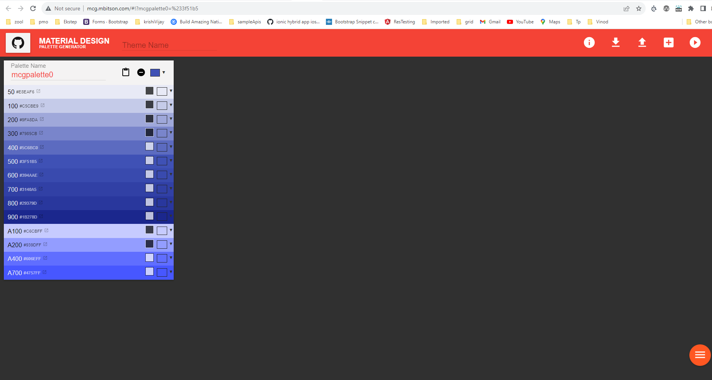
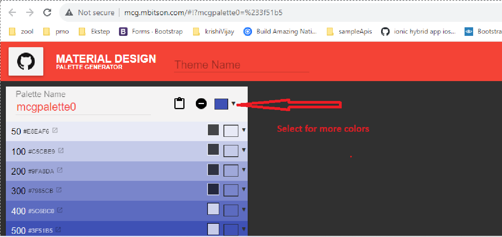
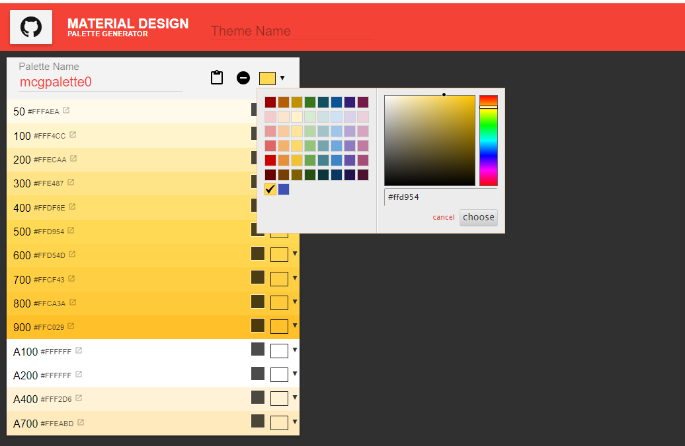
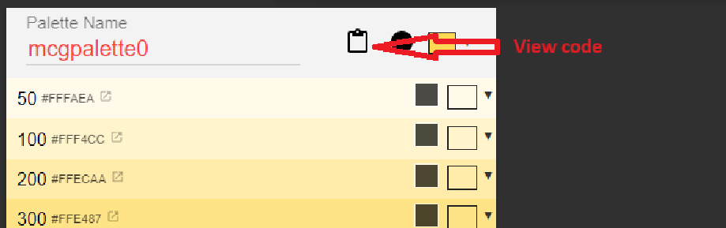
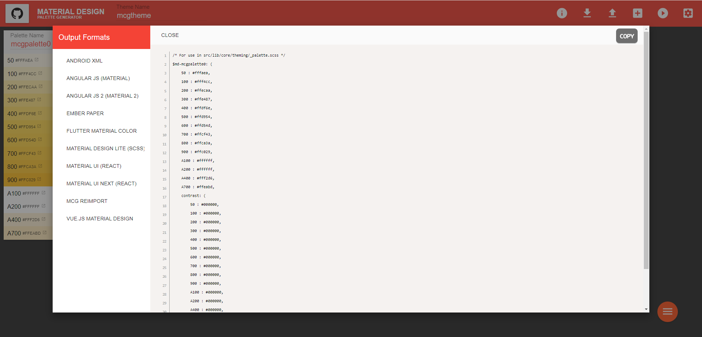

# Palette

### Palette

A **palette** is a set of colors that represents a specific section of the color spectrum. Each color in this set is referred to as a hue. In Material Design, each palette comprises hues identified by numerical values, starting from 50 and then incrementing by 100 up to 900. These numerical identifiers arrange the hues within a palette in a gradient from the lightest to the darkest.

```scss
$indigo-palette: (
 50: #e8eaf6,
 100: #c5cae9,
 200: #9fa8da,
 300: #7986cb,
 // ... continues to 900
 contrast: (
   50: rgba(black, 0.87),
   100: rgba(black, 0.87),
   200: rgba(black, 0.87),
   300: white,
   // ... continues to 900
 )
);
```

### Custom palette

You can create your custom palette by defining a Sass map that matches the structure described in the above Palettes section. The map must define hues for 50 and each hundred between 100 and 900. The map must also define a `contrast` map with contrast colors for each hue.

You can use [**the Material Design palette tool**](http://mcg.mbitson.com/#!?mcgpalette0=%233f51b5) to help choose the hues in your palette.

<figure><figcaption></figcaption></figure>

**Step: 1**  Click the color picker to select a color or manually enter a color code, as demonstrated below.

<figure><figcaption></figcaption></figure>

<figure><figcaption></figcaption></figure>

**Step: 2** Once you've chosen a color, click on the "View Code" icon, as indicated below.

<figure><figcaption></figcaption></figure>

**Step: 3** The "View Code" feature will produce multiple formats, and within the Sunbird-Ed portal, we've employed ANGULAR JS 2 (MATERIAL2). To incorporate the palette code into your application, simply copy it and proceed with integration.

<figure><figcaption></figcaption></figure>

**Step: 4**: Utilize this color code within our "palette.scss" file, situated in the "mat-themes" folder we've previously established. Paste the copied code from the generated palette color and adjust the name from "$md-mcgpalette0" to "$sb-mat-joy-primary."


```scss
$sb-mat-joy-primary: (
  50:  #e9e8d9, // #fffaea, changed application related color 
  100: #f3f3e5, // #fff4cc, changed application related color 
  200: #ffecaa, 
  300: #ffe487,
  400: #ffdf6e,
  500: #ffd954,
  600: #ffd54d,
  700: #ffcf43,
  800: #ffca3a,
  900: #ffc029,
  A100: #ffffff,
  A200: #ffffff,
  A400: #fff2d6,
  A700: #ffeabd,
  contrast: (
    50: #000000,
    100: #000000,
    200: #000000,
    300: #000000,
    400: #000000,
    500: #000000,
    600: #000000,
    700: #000000,
    800: #000000,
    900: #000000,
    A100: #000000,
    A200: #000000,
    A400: #000000,
    A700: #000000,
  ),
);
```


