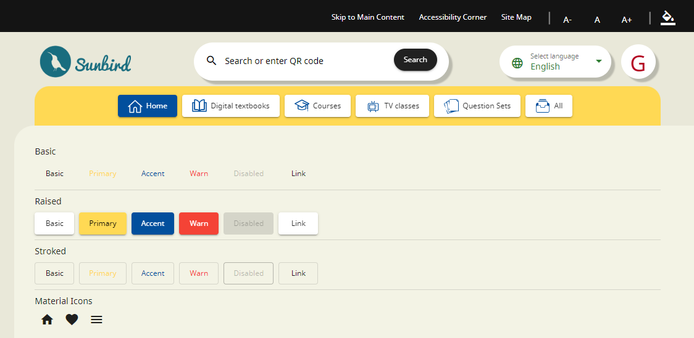

# Material Icons

Angular Material Icons are a set of icons designed to work seamlessly with Angular Material and can be easily integrated into your Angular applications. These icons are based on Google's Material Design Icons and provide a consistent and visually appealing set of symbols for your user interface.

To use Angular Material Icons in your Angular application, follow these steps:

1. **Install Angular Material Icons**: To confirm that Angular Material Icons are installed in our project, we can achieve this by adding the following line in **`style.scss`** file.

```scss
@import url( 'https://fonts.googleapis.com/css?family=Material+Icons');
```

This link imports the Material Icons font, making it available for use in our application.

2. **Use Material Icons in HTML**: We can include Material Icons directly in our HTML templates using the **`<mat-icon>`** element. For example:


```html
<mat-icon>home</mat-icon>
<mat-icon>favorite</mat-icon>
<mat-icon>menu</mat-icon>
```


In this illustration, the icons "**home**," "**favorite**," and "**menu**" will be exhibited utilizing the Material Icons font, as demonstrated below.

<figure><figcaption></figcaption></figure>

Angular Material Icons provide a diverse collection of symbols suitable for a variety of use cases within your Angular applications, making them a valuable enhancement to your UI design. For additional information regarding the available icons and customization options, For further Angular Material Icons, please consult the links provided below.

[**https://v14.material.angular.io/components/icon/overview**](https://v14.material.angular.io/components/icon/overview)&#x20;

[**https://fonts.google.com/icons**](https://fonts.google.com/icons)
