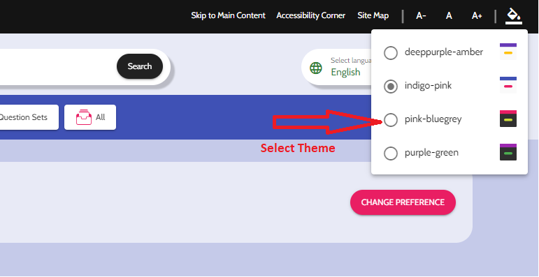

# Theme Setup

### Theme Selector

We have followed a series of steps for the Angular Material theme selector, as listed below:

**Step:  1** We've implemented a menu dropdown using the mat menu for selecting themes, making it convenient to switch between different themes. For this, we have written HTML code in the "**app.component.html**" as follows:

<pre class="language-html" data-line-numbers><code class="lang-html"><strong>&#x3C;div role="navigation" aria-label="Font Size" class="pl-4-min-xs d-flex flex-ai-center">
</strong><strong>  &#x3C;button mat-icon-button id="theme-selector" class="hover-bgcolor-primary" [mat-menu-trigger-for]="themeMenu"
</strong><strong>    matTooltip="Select a theme!" tabindex="0">
</strong>    &#x3C;mat-icon class="auto-flip">format_color_fill&#x3C;/mat-icon>
  &#x3C;/button>
  &#x3C;mat-menu #themeMenu="matMenu" class="themeMenuDropdown">
    &#x3C;button mat-menu-item *ngFor="let theme of themes; let i = index"
      (click)="$event.stopPropagation(); setMatTheme(theme)" class="d-flex flex-ai-center flex-jc-space-between">
      &#x3C;div>
        &#x3C;mat-icon *ngIf="activeTheme === theme" class="mr-0">radio_button_checked&#x3C;/mat-icon>
        &#x3C;mat-icon *ngIf="activeTheme != theme" class="mr-0">radio_button_unchecked&#x3C;/mat-icon>
        &#x3C;span class="mx-8">{{ theme }}&#x3C;/span>
      &#x3C;/div>
      &#x3C;mat-icon role="img" svgicon="theme-example" class="mat-icon {{ theme }} ml-16 mr-0" aria-hidden="true"
        data-mat-icon-type="svg" data-mat-icon-name="theme-example">&#x3C;svg xmlns="http://www.w3.org/2000/svg"
          xmlns:xlink="http://www.w3.org/1999/xlink" width="100%" height="100%" viewBox="0 0 80 80" fit=""
          preserveAspectRatio="xMidYMid meet" focusable="false">
          &#x3C;defs>
            &#x3C;path
              d="M77.87 0C79.05 0 80 .95 80 2.13v75.74c0 1.17-.95 2.13-2.13 2.13H2.13C.96 80 0 79.04 0 77.87V2.13C0 .95.96 0 2.13 0h75.74z"
              id="a">&#x3C;/path>
            &#x3C;path
              d="M54 40c3.32 0 6 2.69 6 6 0 1.2 0-1.2 0 0 0 3.31-2.68 6-6 6H26c-3.31 0-6-2.69-6-6 0-1.2 0 1.2 0 0 0-3.31 2.69-6 6-6h28z"
<strong>              id="b">&#x3C;/path>
</strong>            &#x3C;path d="M0 0h80v17.24H0V0z" id="c">&#x3C;/path>
          &#x3C;/defs>
          &#x3C;use xlink:href="#a" fill="#fff" class="docs-theme-icon-background">&#x3C;/use>
          &#x3C;use xlink:href="#b" class="docs-theme-icon-button">&#x3C;/use>
          &#x3C;use xlink:href="#c" class="docs-theme-icon-toolbar">&#x3C;/use>
          &#x3C;use xlink:href="#d" class="docs-theme-icon-toolbar">&#x3C;/use>
        &#x3C;/svg>&#x3C;/mat-icon>
    &#x3C;/button>
  &#x3C;/mat-menu>
&#x3C;/div>
</code></pre>

**Step: 2** For improved project organization, we've created a distinct SCSS partial file named "**\_palette.scss**" This file has been carefully crafted and is situated within the "**mat-themes**" folder to encompass themes and associated content.

We have included various color palettes in the "**\_palette.scss**" file. For example, as shown below:


```scss
$indigo-palette: (
 50: #e8eaf6,
 100: #c5cae9,
 200: #9fa8da,
 300: #7986cb,
 // ... continues to 900
 contrast: (
   50: rgba(black, 0.87),
   100: rgba(black, 0.87),
   200: rgba(black, 0.87),
   300: white,
   // ... continues to 900
 )
);
```



We will delve further into this section in the upcoming **custom theme** page.


**Step: 3** In the "**app-themes**" section, we have integrated several themes named "**deeppurple-amber**," "**indigo-pink**," "**pink-bluegrey**," and "**purple-green**," as depicted below.


```scss
// Below codes should only be included ONCE in your application.
// Add your desired themes to this map.
$app-themes: (
  deeppurple-amber: (
    primary-base: mat.$deep-purple-palette,
    accent-base: mat.$amber-palette,
    success: mat.$green-palette,
    is-dark: false,
    foreground: mat.$light-theme-foreground-palette,
    background: mat.$light-theme-background-palette,
    typography:
      mat.define-typography-config(
        $font-family: "Arimo",
      ),
  ),
  indigo-pink: (
    primary-base: mat.$indigo-palette,
    accent-base: mat.$pink-palette,
    success: mat.$green-palette,
    is-dark: false,
    foreground: mat.$light-theme-foreground-palette,
    background: mat.$light-theme-background-palette,
    typography:
      mat.define-typography-config(
        $font-family: "Cabin",
      ),
  ),
  pink-bluegrey: (
    primary-base: mat.$pink-palette,
    accent-base: $sbmat-lemongreen,
    success: mat.$red-palette,
    is-dark: true,
    foreground: mat.$dark-theme-foreground-palette,
    background: mat.$dark-theme-background-palette,
    typography:
      mat.define-typography-config(
        $font-family: "Poppins",
      ),
  ),
  purple-green: (
    primary-base: mat.$purple-palette,
    accent-base: mat.$green-palette,
    success: mat.$green-palette,
    is-dark: true,
    foreground: mat.$dark-theme-foreground-palette,
    background: mat.$dark-theme-background-palette,
    typography:
      mat.define-typography-config(
        $font-family: "Quicksand",
      ),
  ),
);
```


**Step: 4** To achieve this, we have included the following code in the "**app.component.ts**" file.

```javascript
import {HostBinding} from '@angular/core'
import {OverlayContainer} from '@angular/cdk/overlay'

const THEME_DARKNESS_SUFFIX = `-dark`
```

And these into the `class` definition:


```javascript
export class AppComponent {
  /* angular material theme  */
  themes: string[] = [
    "deeppurple-amber",
    "indigo-pink",
    "pink-bluegrey",
    "purple-green",
  ];
  
  @HostBinding('class') activeThemeCssClass: string;
  isThemeDark = false;
  activeTheme: string;

  setMatTheme(theme: string, darkness: boolean = null) {
    localStorage.setItem('selectedTheme', theme);
    console.log(theme, darkness);
    if (darkness === null)
      darkness = this.isThemeDark;
    else if (this.isThemeDark === darkness) {
      if (this.activeTheme === theme) return;
    } else
      this.isThemeDark = darkness;

    this.activeTheme = theme;
    const cssClass = darkness === true ? theme + THEME_DARKNESS_SUFFIX : theme;
    const classList = this.overlayContainer.getContainerElement().classList;
    document.documentElement.setAttribute('class', theme);
     if (this.activeThemeCssClass) {
      if (classList.contains(this.activeThemeCssClass))
        classList.replace(this.activeThemeCssClass, cssClass);
      else
        classList.add(cssClass);
     }
      this.activeThemeCssClass = cssClass;
  }

  /* material dark themes */
  toggleDarkness() {
    this.setMatTheme(this.activeTheme, !this.isThemeDark);
  }

  constructor(private overlayContainer: OverlayContainer) {
    const selectedMatTheme = localStorage.getItem('selectedTheme');
    console.log(selectedMatTheme);
    if (selectedMatTheme) {
      this.setMatTheme(selectedMatTheme, false);
    } else {
      this.setMatTheme('joy', false); // Default Theme pink-bluegrey
    }
  }
  ngAfterViewInit() {
    // themeing code
    const trans = () => {
      document.documentElement.classList.add('transition');
      window.setTimeout(() => {
        document.documentElement.classList.remove('transition');
      }, 1000);
    };
    const selector = document.querySelectorAll('input[name=selector]');
    for (let i = 0; i < selector.length; i++) {
      selector[i].addEventListener('change', function () {
        if (this.checked) {
          trans();
          document.documentElement.setAttribute('data-theme', this.value);
        }
      });
    }
    this.setTheme();
  }
  setTheme() {
    const themeColour = localStorage.getItem('layoutColour') || 'default';
    this.setSelectedThemeColour(themeColour);
    document.documentElement.setAttribute('data-theme', themeColour);
  }
  storeThemeColour(value) {
    localStorage.setItem('layoutColour', value);
  }
  setSelectedThemeColour(value) {
    const element = (<HTMLInputElement>document.getElementById(value));
    if (element) {
      element.checked = true;
    }
  }
}
```


We added the code for the theme selector button in the "**themes.scss**" file, as follows:

```scss
.themeMenuDropdown .#{$css-class} use.docs-theme-icon-background {
    fill: map-get($background, background);
  }
```

After completing all the above steps, the **Theme Selector** will appear on our website, enabling us to switch between themes effortlessly, as depicted below.

<figure><figcaption></figcaption></figure>

For more in-depth information on theming and customization options, covering aspects like palettes and best practices for theming, please visit the following links:

[**Angular Material Dynamic Themes**](https://github.com/mirismaili/angular-material-dynamic-themes)**.**

[**Theme Selector Example**](https://stackblitz.com/github/mirismaili/AngularMaterialDynamicThemes?file=src%2Fthemes.scss,src%2Fapp%2Fapp.component.ts)

By following these steps, you can set up and customize themes in Angular Material to achieve the desired look and feel for your application.
