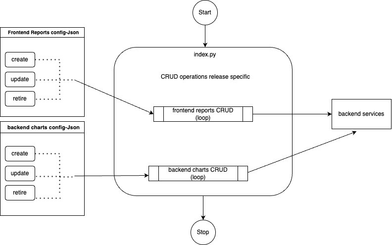

# Report creation and Updation Scripts

Migration scripts are used to create, update or retire Charts and Reports in the respective environments.

The automation scripts will be executed once in all releases to create new reports or charts, update the existing reports or charts or retire existing reports or charts based on the requirements for a release.

During each release, a new folder with the release version is created and the JSON config for the CRUD operation is created in the respective directories.

The index.py file will control the execution of the JSON config. The sequence of execution of the operations can be specified in the index file.

The index file will internally access the library created to call the backend APIs to perform CRUD operations.

The status is logged in the Mongo logger collection to avoid the duplication run of the charts/reports in case of any duplicate execution of the script or any re-run due to error.

\\

<figure><figcaption></figcaption></figure>

Folder Structure :

<figure><figcaption></figcaption></figure>

## Steps to Execute

Step 1: Login to the ml-analytics-service server

Step 2: Switch to the user

`sudo su data-pipeline`

Step 3: Activate virtual environment

`. /opt/sparkjobs/spark_venv/bin/activate`

Step 4: Navigate the release folder inside migrations

`cd /opt/sparkjobs/ml-analytics-service/migrations/releases/6.0.0/`

Step 5: Run the script which will create backend and frontend report configs

`python index.py`

Step 6: Running the Jenkins Job to Generate CSV and JSON in the Cloud

To execute the Jenkins Job and generate the CSV and JSON files in the cloud, please follow the steps below:

1\. Log in to the VPN environment.

2\. Access the Jenkins UI by navigating to the appropriate URL.

3\. Once logged in, locate the "Deploy" section and select the desired environment (e.g., Staging, Production, etc.).

4\. In the selected environment, find the "DataPipeline" folder and click on it.

5\. Inside the "DataPipeline" folder, locate the "RunReportjob" job and click on it.

6\. On the job page, look for the option to "Build with Parameters" and click on it.

7\. You will be prompted to provide the required parameters for the job.

1\. Specify the "report\_id" parameter with the appropriate value.

(Retrieve all the "report\_id" value from the 12th point and pass it here one by one -For example, you can refer to the "ml\_report\_name" value) or (in this path -

https://github.com/Sunbird-Ed/ml-analytics-service/tree/release-6.0.0/migrations/releases/6.0.0/config/backend/create )

Once you have obtained the required "report\_id" value, provide it as the parameter during the job execution.

2\. The "private\_branch" parameter should default to the latest branch, so no action is needed unless specified otherwise.

3\. If there is a "branch\_or\_tag" parameter, it should be set to the same value as the "private\_branch" parameter.

8\. Once you have entered the necessary parameters, click on the "Build" button to start the job.

9\. The Jenkins job will now run, executing the required tasks to generate the CSV and JSON files in the cloud.

10\. Monitor the job's progress through the Jenkins UI to ensure it completes successfully.

11\. Once the job finishes, the CSV and JSON files should be generated in the designated cloud storage location.

12\. Run the RunReportjob in Jenkins with the new report\_id's :

Please note that the specific steps may vary depending on your Jenkins configuration and environment. Ensure you have the necessary permissions and access rights to perform these actions.

RunReportJob :

We utilize the Jenkins job named "RunReportJob" to acquire data or updated information tailored for HawkEye reports, which are displayed in the user interface.

This job functions as a backend process responsible for initiating a data product that retrieves data from Druid, a database system that stores data in both CSV and JSON formats. Once the data retrieval is complete, these files are stored within a Cloud environment. As a subsequent step, the gathered data becomes accessible through a designated portal, allowing users to conveniently view and engage with the generated reports.




