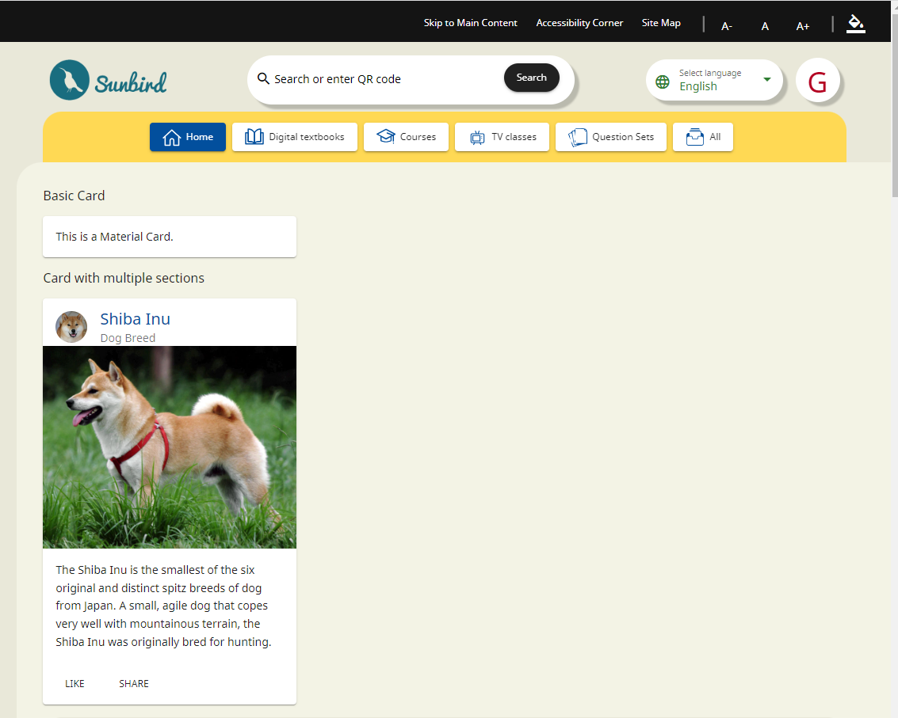

# Components Usage

To use Angular Material components in your Angular application, follow these general steps:

1. **Import the Required Angular Material Modules**: In your Angular module file (e.g., `app.module.ts`), import the Angular Material modules that correspond to the components you want to use. For example, if you want to use **buttons** and **card**, you would import the **`MatButtonModule`** and **`MatCardModule`** modules.


```javascript
import { MatCardModule } from '@angular/material/card';
import { MatButtonModule } from '@angular/material/button';
// Import other required modules as needed
```


2. **Add the Imported Modules to the `imports` Array**: Inside the **`@NgModule`** decorator in your module file, add the imported Angular Material modules to the **`imports`** array.


```javascript
@NgModule({
  declarations: [
    // Your components
  ],
  imports: [
    MatCardModule,
    MatButtonModule,
    // Add other imported modules here
  ],
  providers: [],
})
export class AppModule {}
```


3. **Use Angular Material Components in Your Templates**: In your component templates (HTML files), you can now use Angular Material components by adding the appropriate HTML elements and attributes. For example, to use a button, you can write:


```html
<section>
  <div class="example-label">Basic</div>
  <div class="example-button-row">
    <button mat-button>Basic</button>
    <button mat-button color="primary">Primary</button>
    <button mat-button color="accent">Accent</button>
    <button mat-button color="warn">Warn</button>
    <button mat-button disabled>Disabled</button>
    <a mat-button href="https://www.google.com/" target="_blank">Link</a>
    </div>
</section>
<mat-divider></mat-divider>
<section>
  <div class="example-label">Raised</div>
  <div class="example-button-row">
    <button mat-raised-button>Basic</button>
    <button mat-raised-button color="primary">Primary</button>
    <button mat-raised-button color="accent">Accent</button>
    <button mat-raised-button color="warn">Warn</button>
    <button mat-raised-button disabled>Disabled</button>
    <a mat-raised-button href="https://www.google.com/" target="_blank">Link</a>
  </div>
</section>
<mat-divider></mat-divider>
<section>
  <div class="example-label">Stroked</div>
  <div class="example-button-row">
    <button mat-stroked-button>Basic</button>
    <button mat-stroked-button color="primary">Primary</button>
    <button mat-stroked-button color="accent">Accent</button>
    <button mat-stroked-button color="warn">Warn</button>
    <button mat-stroked-button disabled>Disabled</button>
    <a mat-stroked-button href="https://www.google.com/" target="_blank">Link</a>
  </div>
</section>
```


The expected output is as follows:

<figure><figcaption></figcaption></figure>

For more information about buttons, please visit the following link:

[**https://v14.material.angular.io/components/button/overview**](https://v14.material.angular.io/components/button/overview)

**And to use a card:**


```html
//Basic card
<mat-card>
  <mat-card-content>
    This is a Material Card.
  </mat-card-content>
</mat-card>

//Card with multiple sections
<mat-card class="example-card">
  <mat-card-header>
    <div mat-card-avatar class="example-header-image"></div>
    <mat-card-title>Shiba Inu</mat-card-title>
    <mat-card-subtitle>Dog Breed</mat-card-subtitle>
  </mat-card-header>
  
  <mat-card-content>
  <p>
      The Shiba Inu is the smallest of the six original and distinct spitz breeds 
       of dog from Japan. A small, agile dog that copes very well with mountainous 
       terrain, the Shiba Inu was originally bred for hunting.
  </p>
</mat-card-content>
<mat-card-actions>
  <button mat-button>LIKE</button>
  <button mat-button>SHARE</button>
</mat-card-actions>
</mat-card>
```


The expected output is as follows:

<figure><figcaption></figcaption></figure>

For more information about **cards**, please visit the following link:

[**https://v14.material.angular.io/components/card/overview**](https://v14.material.angular.io/components/card/overview)

### Customize and Style

To personalize and style Angular Material components within your Angular application, you have various techniques at your disposal. These include CSS, Angular Material theming, and component-specific customization options, which will be elaborated on in the upcoming sections.

### Additional Configuration

Adding Angular Material components to your application is a straightforward process, as you can easily include them in your templates. Be aware that for specific components, you may need to import additional modules and styles. For a comprehensive guide on using each component and understanding their dependencies, kindly refer to the following link.

[**https://v14.material.angular.io/components/categories**](https://v14.material.angular.io/components/categories)
