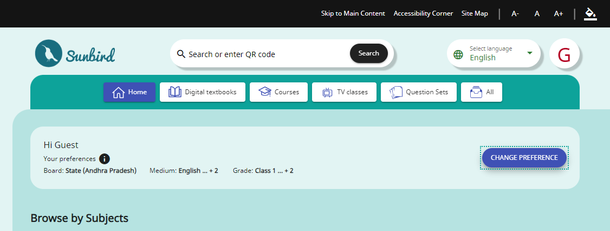

# Accessibility

Accessibility in Angular Material refers to the design and development practices that ensure web applications built with Angular Material are usable by people with disabilities. Angular Material provides built-in features and guidelines for creating accessible web applications. Here are some key aspects of accessibility in Angular Material:

1. **ARIA (Accessible Rich Internet Applications) Support**: Angular Material components are designed to be accessible by default. They include ARIA attributes and keyboard navigation support to ensure screen reader users and keyboard-only users can interact with the components effectively.
2. **Keyboard Navigation**: Angular Material components are navigable using keyboard controls. Users can navigate through components, interact with form elements, and trigger actions using keyboard shortcuts.
3. **Focus Management**: Angular Material components manage focus states appropriately, ensuring that users can understand where the keyboard focus is and navigate the application seamlessly.
4. **High Contrast Mode**: Angular Material components support high contrast mode, making it easier for users with vision impairments to read and interact with the application.
5. **Semantic HTML**: Angular Material encourages the use of semantic HTML elements, such as buttons, links, and headings, to ensure that the structure of the page is meaningful to assistive technologies.
6. **Theming and Color Contrast**: Angular Material offers guidelines for theming and color contrast, ensuring that text and interactive elements maintain adequate contrast with their backgrounds, thereby enhancing readability and usability. To address color contrast concerns, we employed the "**Wave Evaluation Tool**" Chrome extension, available for installation from the Chrome Web Store [**here**](https://chrome.google.com/webstore/detail/wave-evaluation-tool/jbbplnpkjmmeebjpijfedlgcdilocofh).
7. **Screen Reader Testing**: To ensure accessibility, Angular Material components undergo testing with popular screen readers such as VoiceOver (iOS), NVDA (Windows), or JAWS (Windows). Additionally, we employed the "**Screen Reade**r" Chrome extension for testing purposes, available for installation from the Chrome Web Store [**here**](https://chrome.google.com/webstore/detail/screen-reader/kgejglhpjiefppelpmljglcjbhoiplfn).
8. **Documentation**: Angular Material's documentation includes information on accessibility best practices, including guidance on how to make custom components accessible and how to handle complex interactions.
9. **Community Contributions**: The Angular Material community actively contributes to improving accessibility by reporting issues and providing solutions.

To enhance accessibility identification, we've included a dotted border in the "**themes.scss**" file. You can review the code and observe the output as shown below.

```scss
@include mat.strong-focus-indicators((border-style: dotted,
    border-width: 0.125rem,
    border-radius: 0.125rem,
  ));
```

<figure><figcaption></figcaption></figure>

It's essential for developers using Angular Material to follow accessibility guidelines and test their applications with accessibility tools to ensure that they are usable by all users, including those with disabilities. Accessibility is a fundamental aspect of web development that promotes inclusivity and a positive user experience for everyone.
