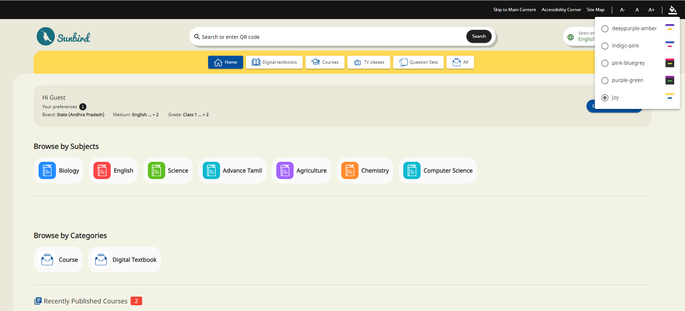
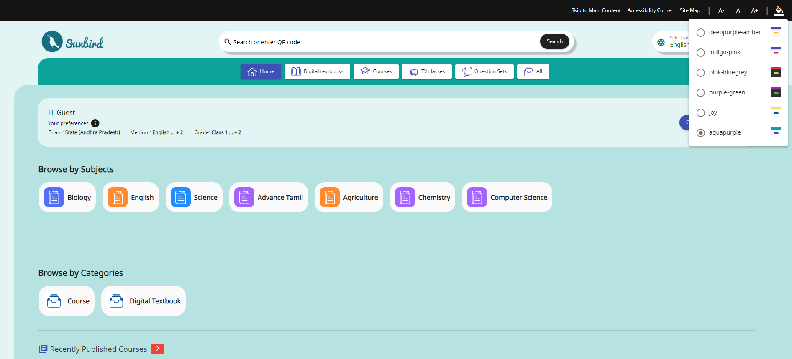

# Theme

Angular Material's theming system is widely recommended for achieving consistent and manageable custom styles throughout your application. It offers a structured and efficient approach to defining and implementing custom themes, facilitating a cohesive and visually pleasing design.

### Custom Theme

Within the same "**\_palette.scss**" file, we have defined a theme called "**Joy**" within the "**app-themes**" section. We have configured various parameters using the created palettes, as demonstrated below.

````scss
$app-themes: (
  //newly added theme
  joy: (
    primary-base: $sb-mat-joy-primary,
    accent-base: $sb-mat-joy-accent,
    success: mat.$green-palette,
    is-dark: false,
    foreground: mat.$light-theme-foreground-palette,
    background: mat.$light-theme-background-palette,
  ),
```
);
````

After defining the theme, we need to include it in the "**app.component.ts**" file, as illustrated below.

```typescript
themes: string[] = [
    "deeppurple-amber",
    "indigo-pink",
    "pink-bluegrey",
    "purple-green",
    "joy"
  ];
```

After completing the aforementioned steps, you will notice that the "**Joy**" theme has been applied to our website, as shown below.

<figure><figcaption></figcaption></figure>

### Themes Customization <a href="#themes" id="themes"></a>

A **theme** is a collection of color and typography options. Each theme includes three palettes that determine component colors:

* A **primary** palette for the color that appears most frequently throughout your application
* An **accent**, or _secondary_, palette used to selectively highlight key parts of your UI
* A **warn**, or _error_, palette used for warnings and error states

We included the relevant code in the "**themes.scss**" file located within the "**mat-themes**" folder.

```scss
$primary: if(map-has-key($theme, primary),
      map-get($theme, primary),
      mat.define-palette(map-get($theme, primary-base)));
  $accent: if(map-has-key($theme, accent),
      map-get($theme, accent),
      mat.define-palette(map-get($theme, accent-base)));
  $success: if(map-has-key($theme, success),
      map-get($theme, success),
      mat.define-palette(map-get($theme, success-base)));
  $warn: if(map-has-key($theme, warn),
      map-get($theme, warn),
      mat.define-palette(if(map-has-key($theme, warn-base),
          map-get($theme, warn-base),
          mat.$red-palette)));
  $background: if(map-has-key($theme, background),
      map-get($theme, background),
      mat.define-palette(if(map-has-key($theme, background),
          map-get($theme, background),
          $background)));
  $foreground: if(map-has-key($theme, foreground),
      map-get($theme, foreground),
      mat.define-palette(if(map-has-key($theme, foreground),
          map-get($theme, foreground),
          $foreground)));
```

For existing light theme CSS variables in **themes.scss** file, we have also recreated them using Angular Material theme palettes, as illustrated below.

<pre class="language-scss"><code class="lang-scss"><strong>    $primary50: mat.get-color-from-palette($primary, 50);
</strong>    $primary100: mat.get-color-from-palette($primary, 100);
    $primary200: mat.get-color-from-palette($primary, 200);
    --sbt-body-bg: var(--color-primary-50);
    --sbt-body-bg2: var(--color-primary-100);
    --sbt-footer-bg: var(--sbt-body-bg2);
    --cc-grade-pill-container-bg: var(--sbt-body-bg);
    --sbt-compt-bg: var(--sbt-body-bg);
    --cc-chapter-bg: var(--sbt-body-bg2);
    --sbt-filter-bar-bg: var(--sbt-body-bg);
    --sbt-box-shadow-black: rgba(var(--rc-rgba-black), 0.2);
    --sbt-box-shadow-6px: 0.375rem 0.375rem 0.125rem 0 var(--sbt-box-shadow-black);
    --sbt-box-shadow-3px: 0.1875rem 0.1875rem 0.125rem 0 var(--sbt-box-shadow-black);
    --sbt-bradius: 0.125rem;
    --sbt-bradius-8: calc(var(--sbt-bradius) * 4);
    --sbt-bradius-16: calc(var(--sbt-bradius) * 8);
    --sbt-bradius-24: calc(var(--sbt-bradius) * 12);
    --sbt-bradius-32: calc(var(--sbt-bradius) * 16);
    --sb-graph-section-bg: var(--sbt-body-bg2);
    --mat-list-bg-active: var(--sbt-body-bg);
    --mat-list-border-active: var(--sbt-body-bg2);
</code></pre>

Similarly, we have added the same for the **dark mode**, as demonstrated below.

```scss
     $primary100: map-get($background,
          background); // mat.get-color-from-palette($accent, 900);
      $primary200: #232323;
      --sbt-body-bg: #{$primary100};
      --sbt-body-bg2: #{$primary200}; // 232323
      // --sb-profile-bg-c-4: var(--sbt-body-bg);
      --sbt-footer-bg: var(--sbt-body-bg2);
      --cc-grade-pill-container-bg: var(--sbt-body-bg);
      --sbt-compt-bg: var(--sbt-body-bg);
      --sb-modal-content-bg: var(--sbt-body-bg);
      --sb-modal-actions-bg: var(--sbt-body-bg);
      --cc-chapter-bg: var(--sbt-body-bg2);
      --sb-section-preference: var(--white);
      --sbt-footer-info-links: var(--white);
      --sbt-filter-bar-bg: var(--sbt-body-bg);
      --list-container-bg: var(--sbt-body-bg2);
      --user-profile-box: var(--sbt-body-bg);
      --mat-list-bg: var(--sbt-body-bg);
      --mat-list-border: var(--sbt-body-bg);
      --mat-list-border-active: var(--color-success-500);
      --mat-list-bg-active: var(--sbt-body-bg2);
      --dot-divider: #fff;
      --cc-mat-card-img-container-border:#232323;
      //lazy loading styles
      --cc-mat-card-animation-bg: #333;
      --cc-mat-card-loading-bg: #666;
      --cc-mat-card-loading-highlight1: #555;
      --cc-mat-card-loading-highlight2: #777;
      --mat-footer-bg: #232323;
```

### Multiple Themes in one file

In Angular Material, you can define and manage multiple themes within a single SCSS file, allowing you to organize and maintain your theme-related code efficiently. Here's a general approach for implementing multiple themes in a single file:

1. **Set Up Your Themes:** Define your different themes using Sass maps, where each map represents a theme. These maps should include various color palettes and theme-specific settings. For example:

```scss
$app-themes: (
joy: (
    primary-base: $sb-mat-joy-primary,
    accent-base: $sb-mat-joy-accent,
    success: mat.$green-palette,
    is-dark: false,
    foreground: mat.$light-theme-foreground-palette,
    background: mat.$light-theme-background-palette,
    typography:
      mat.define-typography-config(
        $font-family: var(--font-stack-en),
      ),
  ),
  aquapurple: (
    primary-base: $sbmat-aqua,
    accent-base: $sbmat-purple,
    success: mat.$green-palette,
    is-dark: false,
    foreground: mat.$light-theme-foreground-palette,
    background: mat.$light-theme-background-palette,
    typography:
      mat.define-typography-config(
        $font-family: var(--font-stack-en),
      ),
  ), 
);
```

In the example above, we have included two themes named "**Joy**" and "**Aquapurple**" within the "**app-themes**" section of the "**\_palette.scss**" file, which is located in the "**mat-themes**" folder.

2. **Include in themes object**

After defining the theme, we need to include it in the "**app.component.ts**" file, as illustrated below.

```typescript
themes: string[] = [
    "deeppurple-amber",
    "indigo-pink",
    "pink-bluegrey",
    "purple-green",
    "joy",
    "aquapurple"
  ];
```

And  the expected result is:

<figure><figcaption></figcaption></figure>
